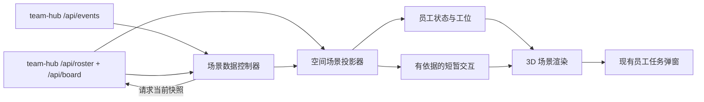

# Legion 空间像素员工 3D 场景设计

> 日期：2026-09-27  
> 状态：待业主评审  
> 范围：Workbench 首页的单空间中央场景、空间外观配置、事件驱动的员工表现  
> 决策：采用可旋转的方块造型 3D 员工，参考 cc-haha 的状态归一化与动作节奏

## 1. 意图与完成标准

用户希望每个工作空间的中央区域成为一间可观察的 3D 办公室。空间有自己的编队与布置；员工有清楚可辨的像素风身份，随真实任务状态走向工位、工作、等待验收、受阻和完成。员工之间的交接要对应可核对的任务关系。点击员工继续打开现有任务清单与详情。

设计成功时，用户在截图所示的中央区域能够回答三个问题：**谁在做事、谁需要我处理、刚刚发生了什么**。切换空间后只看到该空间的员工和任务；刷新或断线后，画面最终收敛到中枢事实。场景有观赏性，但不代替任务中心，也不向用户暗示并不存在的协作。

首版验收面向现有约 12 人的空间，同时对 0 人、1 人和多于 12 人的编队保持可用。`全部空间` 继续显示跨空间概览；它不是把所有空间的员工塞进同一间办公室。

## 2. 已核对的现状与参考

### 2.1 Legion

- `workbench/src/components/Scene3D.tsx` 已用 React Three Fiber、drei 和 Three.js 绘制地板、会议桌与围桌角色，状态只有 `busy | review | blocked | idle`。角色由圆柱与发光球体组成，点击可把角色 id 交给 `CenterPanel`。
- `workbench/src/components/CenterPanel.tsx` 在具体空间中渲染 3D 场景，在 `全部空间` 中展示分组概览。它将 `/api/roster` 的 `role` 用作场景 id，并复用 `AgentTasksModal` 与 `TaskDetailModal`。
- `team-hub/routes/team-views.mjs` 的 `/api/roster?scope=` 按编队与任务产生状态投影，优先级为 `blocked > review > busy > idle`。同一空间未入编队的执行者会作为 `external` 员工补入。`tasks` 仅含未完成任务的 `id/title/status`。
- `workbench/src/App.tsx` 目前在 `hubMode/scope` 变化时拉取一次编队；首页没有订阅 `/api/events` 去刷新它。因此“状态实时投影”在中央场景中可能停留在旧快照。`App.refresh()` 也没有刷新编队。
- `workbench/src/hubEventStream.ts` 已提供带 scope 过滤、持久游标、去重与断线重连的事件订阅；`team-hub` 的审计事件带 `seq/ts/scope/action/taskId/goalId/payload`。任务生命周期已有 `claim`、`transition`、`advance` 审计动作。
- `Scene3D` 现在按人数扩张围桌半径：12 人半径为 7.44，而地板尺寸为 16×12；部分角色会落到地板短边之外，人物被镜头拉小。悬浮名牌也比人物更抢眼。
- `spaces` 当前保存名称、私有标记与仓库绑定，没有场景风格字段。`GET /api/spaces` 合并已注册空间与从编队/任务推导出的旧 scope。

### 2.2 cc-haha

参考项目的[桌面宠物文档](https://github.com/NanmiCoder/cc-haha/blob/main/docs/en/desktop/pets.md)、[会话状态模型](https://github.com/NanmiCoder/cc-haha/blob/main/desktop/src/features/pets/petSessionModel.ts)、[动作播放模型](https://github.com/NanmiCoder/cc-haha/blob/main/desktop/src/features/pets/petAnimation.ts)和[Agent Teams 画布](https://github.com/NanmiCoder/cc-haha/blob/main/desktop/src/components/agentTeams/AgentTeamsCanvas.tsx)提供三点可复用的设计经验：

1. 先把业务源归一为少量可信状态，再映射到动作；不要直接让渲染组件解释各类原始事件。
2. 持续状态使用循环动作；挥手、跳跃等短动作播放有限次数，然后回到持续状态。
3. 角色、任务与消息关系同时可见，角色点击可回到真实工作对象。

cc-haha 的宠物本身是 2D 动作图集。Legion 现有场景可旋转，因此本设计制作自己的方块造型 3D 员工和动作，不直接移植该图集或其人物资产。原项目作为交互与状态设计参考；如未来复用任何代码或资源，另行核对对应许可证及第三方素材清单。

## 3. 方案边界

### 包含

- 单空间 3D 办公室布局、方块造型员工、岗位差异、移动与状态动作。
- 当前空间的事件订阅、快照刷新与断线校正。
- 有事实依据的员工交接提示与短动作。
- 空间场景预设的保存与设置入口。
- 点击员工进入现有任务路径、弱设备与减少动态效果的降级路径。

### 暂不包含

- 新任务状态、自动派工、员工自主决策或聊天代理行为。
- 自由布置家具、上传角色模型、逐岗位单独制作骨骼模型。
- 依靠猜测生成员工对话、审批等待或执行失败；这些需要明确的数据归属。
- `全部空间` 的跨空间 3D 大地图。

## 4. 总体结构与职责



| 单元 | 责任 | 依赖与边界 |
| --- | --- | --- |
| 场景数据控制器 | 订阅当前 scope 的事件、合并请求、读取编队与任务快照、处理重连和过期响应 | 使用现有 API；不改变任务状态 |
| 场景投影器 | 把 `RosterAgent[]`、任务快照与最近事件转成稳定的 `SceneAgent[]` 和短动作 | 纯函数；不访问 WebGL 或网络 |
| 空间布局器 | 根据预设与人数生成地板、工位、公共站点和镜头边界 | 不关心任务状态 |
| 员工角色 | 共用方块模型、岗位配色与小道具，播放 `idle/walk/work/review/blocked/celebrate` | 只接收场景投影结果 |
| 场景入口 | 悬停、选中、点击、键盘焦点；打开既有弹窗 | 不直接写任务 |
| 空间配置 | 保存 `scenePreset`，让新旧空间均能读取默认值 | 与任务执行配置分离 |

实现位置预期集中在 `workbench/src/components/Scene3D.tsx` 周边的新小模块、`App/CenterPanel` 的数据接线、`SpaceSettingsModal/NewSpaceModal` 与现有 spaces 读写路径。大组件只负责组合，状态归一与布局计算独立，便于无 WebGL 测试。

## 5. 数据与事件契约

### 5.1 场景输入

每次进入一个具体空间，读取同一 scope 的 `/api/roster`、`/api/board` 和 `/api/spaces` 中该空间配置。`/api/roster` 是员工集合、显示名、身份与四态的权威投影；任务快照用于当前任务、依赖关系及完成过渡。`/api/spaces` 给出预设。`goalPercent` 继续来自现有目标汇总，不重新计算业务进度。

场景内部的员工键为 `scope + '\u0000' + role`。视图与弹窗传参仍保留原 `role` 和 `scope`。`external` 员工也使用同样的空间隔离键，佩戴临时成员样式，不因未入编队而消失。当前 `AgentTasksModal` 的任务归属筛选与 `/api/roster` 的 `(task.role ?? task.soldier)` 口径不同；实施时须对齐，并验证临时执行者点击后看到的任务与其场景状态一致。

推荐的前端投影形状如下；这是内部展示模型，不新增公开写接口：

```ts
type SceneAgent = {
  key: string; scope: string; role: string; name: string; external: boolean
  mode: 'idle' | 'busy' | 'review' | 'blocked'
  activity: 'idle' | 'walk' | 'work' | 'review' | 'blocked' | 'celebrate'
  taskIds: string[]; focusTaskId: string | null
  stationId: string; appearanceSeed: number
}

type SceneCue = {
  id: string; scope: string; kind: 'completed' | 'handoff'
  fromRole: string; toRole?: string; taskId: string
  eventSeq: number; expiresAtMs: number
}
```

`appearanceSeed` 由稳定的 `scope + role` 哈希得到，颜色与配饰在刷新后不变。员工实际状态始终从最新快照产生；`SceneCue` 只负责短暂表现，不能覆盖业务状态。

### 5.2 更新顺序

1. 进入具体空间时先建立 scope 订阅，再发起首轮快照请求；订阅建立和重连成功时再校正一次快照，覆盖连接边界的竞态。
2. `create`、`claim`、`transition`、`advance`、`goal:publish`、`agent:create`、`space:add-agents` 等会改变场景的事件触发刷新。对同一波事件做约 150–300 ms 合并，避免发布一条目标链时反复重建场景。
3. 事件只表示“需要重读事实”。`claim` 的 `payload.soldier`、`transition` 的 `payload.to` 可用于候选短动作，但是否展示必须与刷新后的任务事实相符。
4. 沿用现有 SSE `seq` 去重和 scope 过滤。跨 scope 的事件不能改变当前场景；切空间时取消旧订阅并使旧请求结果失效。
5. 页面可见时约每 20 秒校正一次快照；从后台回到前台、SSE 重连和手动刷新时立即校正。页面隐藏时停止 3D 帧更新，不需要让员工在后台持续走动。
6. 请求失败时保留最后成功快照并显示“状态更新中断”，重试成功后清除提示。首次读取失败时显示现有 2D 员工卡片或明确的连接错误，不把空响应误认为“没有员工”。

首版只在首页的具体空间挂一条场景订阅；`全部空间` 与其他模块沿用各自现有逻辑。场景关闭时释放订阅和计时器。现有 `/api/events` 仍是唯一公开业务事件流。

### 5.3 旧 v1 模式

team-hub 不可达时，沿用 `board` 聚合的员工与四态，显示通用办公室；不生成需要任务依赖、完整审计序号或空间配置才能证实的交接动作。v1 无 `AgentTasksModal` 所需的 hub 数据时，角色点击保持现有可用边界。

## 6. 状态机与员工交互

### 6.1 持续状态

| 业务事实 | 地点与持续动作 | 呈现信息 |
| --- | --- | --- |
| 编队存在，只有 `backlog/todo` 或无任务 | 自己的工位；低频待命动作 | 待命或待办数量 |
| 至少一个 `in_progress` | 自己的工位；工作循环 | 当前任务与进行中数量 |
| 至少一个 `in_review`，且没有受阻任务 | 评审位附近；提交/等待动作 | “待验收”，点击进入任务 |
| 至少一个 `blocked` | 工位或求助位；受阻动作 | 阻塞标记与任务入口 |

多任务时沿用 `/api/roster` 的优先级 `blocked > review > busy > idle`；工位旁可以显示其他任务数量，不丢失并行事实。`in_review` 不播放成功庆祝，`blocked` 不标作执行失败。`goal` 暂停、全局暂停和审批等待仅在有能准确指向该员工或任务的正式数据后才增加对应动作；首版保留界面已有的文字与按钮，不从宽泛审计事件猜测。

### 6.2 短暂动作

- `claim` 经快照确认后，员工走向自己的工作位并开始工作；首次加载已有 `in_progress` 任务时直接处于工作位，不重演旧认领。
- 任务由非 `done` 变为 `done`，且当前页面在该空间可见、事件时间距当前不超过 8 秒时，员工播放一次约 1–2 秒的完成动作，再回其最新持续状态。重连回放和刷新历史不重演庆祝。
- 一条后续任务的 `blockedBy` 包含已完成的前序任务 id，且后续任务随后被另一角色认领时，触发两工位间的一次交接提示。两任务必须同 scope；任一任务有 `goalId` 时，两者的 `goalId` 必须相同且非空。缺失角色或任务归属时不生成交接。
- 交接只短暂点亮连线、文件/接力图标及两人的抬头动作；不改变任一员工的业务状态或强行把正在处理其他任务的员工移走。

同一 `eventSeq + taskId + kind` 最多播放一次。短动作以新事件覆盖同一员工较旧的短动作；业务状态变化优先于动画收尾。`SceneCue` 过期即销毁，不入库。

## 7. 场景与视觉设计

### 7.1 空间预设

`scenePreset` 采用有限枚举：`office`（通用）、`studio`（策划/内容）、`lab`（软件/研发）、`operations`（运营/控制台）。预设只决定地板材质、墙面/光色、家具组合与公共站点外观；员工身份、任务状态与交互契约完全相同。新空间在创建第一步选择预设，空间设置中可随时修改。既有注册空间以及推导出的旧 scope 默认 `office`，用户可显式选择其他预设。

`spaces` 表增加 `scene_preset TEXT DEFAULT 'office'`，使用现有幂等 `ensureColumn` 迁移。`GET /api/spaces` 和 `POST /api/spaces` 返回/接受 `scenePreset`；服务端只接受四个枚举值。旧客户端未提交该字段时，更新已有空间应保留已存值，新建空间用 `office`。`scenePreset` 不参与派工、仓库绑定、权限或空间删除计数。

### 7.2 地板、工位与镜头

- 使用正交相机形成稳定的等距默认视角，默认关闭自动旋转；用户可有限度旋转和缩放。默认镜头须自动框住地板及全部员工，避免当前 12 人站在地板之外。
- 角色与家具使用确定性的网格/工位布局。1–12 人用双排工位；超过 12 人时增加工位排数并扩张地板，镜头按边界自适应。任何人数都不把员工放在地板之外。中心留出可读的目标装置与通道。
- 工位由编队顺序稳定分配；仅编队成员集合或预设变化时重排。单纯任务状态更新不得改变站位。
- 员工基础形体为共用的方块头、躯干、四肢；单个员工控制在约 10–18 个主要方块部件内。衣服和面部使用低分辨率纹理、最近邻采样与有限色板，保留像素边缘；工作、等待、受阻由姿态与小道具表达。岗位颜色、胸牌和工具由稳定身份种子选择。外部执行者使用独立配色/标识。
- 状态颜色沿用现有绿、黄、红、蓝语义，但以地面光圈、胸牌或边缘光显示；角色本身仍可辨认。灯光提高人物与家具对比度。
- 常态只显示短名称和状态点；悬停、键盘焦点或选中时显示完整名称、当前任务和数量。标签不遮住人物或穿透任务弹窗；状态同时有文字和形状，不仅靠颜色。

### 7.3 交互与可访问性

点击员工或其名牌打开现有 `AgentTasksModal`，再点击任务进入 `TaskDetailModal`。公共站点仅解释场景含义，不直接触发任务写操作。键盘用户可用与场景同步的员工列表选择角色；WebGL 不可用时该列表成为默认显示。遵循 `prefers-reduced-motion` 与场景内“动画开关”：关闭时仍更新角色位置、状态和文字，只停止行走与短动作。

## 8. 性能、恢复与边界

- 共用几何体、材质与基础动作，不为每位员工复制独立高精模型。仅当前可见的单空间加载 3D chunk。
- 默认限制设备像素比并使用按需渲染；持续动作期间可短时维持帧循环，页面隐藏或动画关闭时停止。超过 12 人仍显示全部员工，必要时降低阴影、粒子和道具复杂度。
- 以普通笔记本浏览器、12 人空间为基准，交互时以稳定 30 FPS 为最低验收目标，60 FPS 为优化目标；实际按目标环境实测，不以代码推断性能。
- 场景所显示的任务状态应在 SSE 正常时于事件到达后 2 秒内更新；断线时页面可见状态由约 20 秒校正恢复。该时间仅指界面反映已提交事实，不承诺任务本身的执行速度。
- 后到的旧请求、旧 scope 事件、重复 seq 和旧快照均不能覆盖较新的场景。角色配饰、座位与布局不随普通数据刷新闪动。
- 目标刚完成时，员工是否庆祝由自己任务的 `done` 决定；目标百分比变化本身不让全员庆祝。

## 9. 验收与验证

### 9.1 业务契约

1. 对 `idle/busy/review/blocked` 的组合测试确认优先级、文字和动作；`todo` 不会被误标成工作中。
2. `claim → in_progress → in_review → done` 在单空间场景中形成对应视觉过程；`in_review` 阶段没有完成动作。
3. 前序任务完成但后序未认领、无 `blockedBy`、跨空间、角色未知时均不产生员工交接。
4. 重连回放旧事件、重复 seq、刷新页面和切回空间不重演已过期的短动作。
5. 同名 role 在两个 scope 中的颜色、任务和临时动作互不串台；`external` 角色可见且可打开正确任务。
6. 新旧客户端保存空间配置后，`scenePreset` 正确返回；旧客户端更新名称/仓库绑定不清除已有预设。

### 9.2 界面与恢复

1. 对 0、1、8、12、24 人拍摄固定视角截图：员工始终在地板内，人物与状态标识可读，名牌不压住关键区域。
2. 在截图所示的中央面板尺寸和较窄窗口中检查镜头、点击命中与弹窗层级。
3. 断开/恢复 SSE、切换 scope、快速连续写任务和手动刷新后，场景最终与 `/api/roster` 一致；首次加载失败有清楚提示。
4. WebGL 不可用、减少动态效果、键盘导航和页面后台切换有可用的员工列表与准确状态。
5. 保留 Workbench 构建、现有 hub 事件流、空间配置与编队路由的相关测试；新增投影纯函数、事件协调和空间预设契约测试。只在最终集成时做 12 人性能与视觉检查。

## 10. 建议的实施切片与退出条件

1. **状态通路**：先让首页基于当前 scope 的事件刷新编队与任务，补上手动刷新、重连和过期响应处理。退出条件：不换空间也能看到任务状态变化，跨空间不串台。
2. **可读的 3D 员工与布局**：替换圆柱角色和围桌半径，建立共用角色、确定性工位、相机自适应及 2D 降级。退出条件：12 人场景与窄屏都能读清人物和状态。
3. **业务动作与交接**：加入纯状态投影、短动作队列与任务依赖判据。退出条件：正常流程有动作反馈，反例不会出现虚构交接或误庆祝。
4. **空间预设与设置**：扩展 `spaces` 契约、创建/设置 UI 和四种场景素材。退出条件：新旧空间均可选择预设，旧客户端更新保留已选值。
5. **集成验收**：验证点击任务、断线恢复、减少动态效果及 12 人性能。退出条件：第 9 节全部通过，再将旧场景实现移除。

## 11. 主要风险与处理

| 风险 | 处理 |
| --- | --- |
| SSE 到达时任务快照尚未更新、事件与请求乱序 | 事件只触发重读；请求按 scope 与代次接纳；连接建立后再校正 |
| 完成和交接动画把历史回放当成现场 | 时间窗、seq 去重、首屏不重演；最终状态始终来自快照 |
| 角色与任务归属口径不一致 | 以 `/api/roster` 归属为基准，对齐员工弹窗筛选并加契约测试 |
| 大编队导致模型与标签拥挤 | 网格扩张、镜头自适应、按需显示标签和分级渲染 |
| 新空间主题字段破坏旧客户端保存 | 字段可选、服务端校验、旧请求保留已存预设、默认值迁移 |
| 装饰行为被误读为真实协作 | 仅从任务依赖与认领导出交接，短动作不改变任务事实 |

## 12. 评审焦点

本设计固定了**3D 方块造型员工、四种持续业务状态、以任务事实校正事件动画、四种空间预设**。评审时重点确认：这四种预设是否覆盖你现有的主要空间，以及“后序任务认领且明确依赖前序任务”是否符合你想看到的员工交接含义。确认后再编写逐文件的实施计划；此文档本身不授权开始实现。
