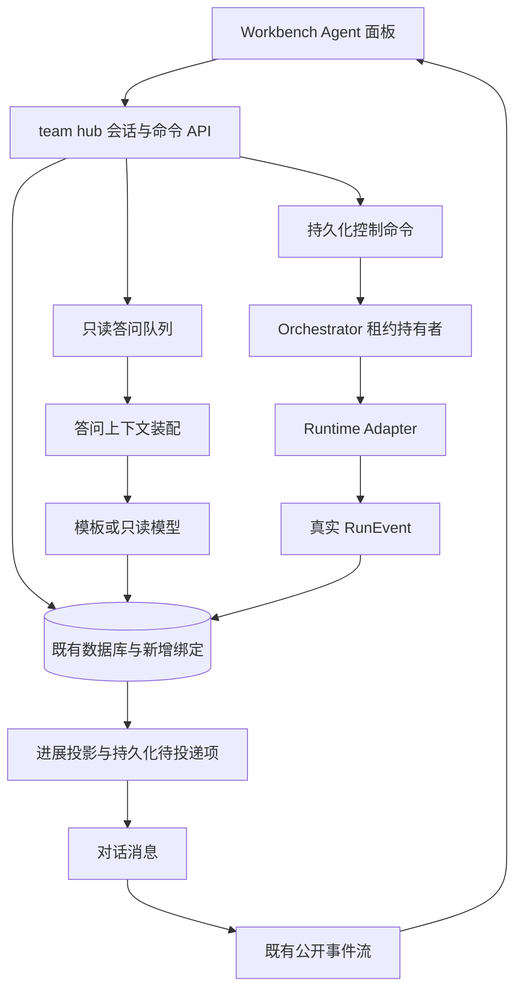
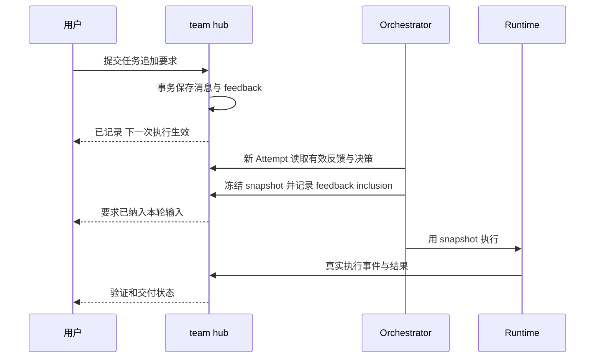

# Legion Agent 对话与任务进展设计方案

本文面向 Legion 产品与工程实现，设计一个围绕具体 Agent 的交互入口：用户可以与每个 Agent 持续对话，查询真实工作状态，收到关键进展，回答阻塞问题，并将追加要求可靠地交给执行流程。方案复用 Workbench、team-hub、Orchestrator 和 Runtime Contract，不引入第二个通信中枢。

状态：设计提案，尚未实施。日期：2026-10-01。代码核对基线：工作区 HEAD `50bbf64e` 及当时可见源码；工作区存在其他进行中的修改，本方案不修改它们。本文的新增表、接口、组件、参数和性能指标均为拟议契约，不代表已经具备的能力。实施前应重新核对最新代码和 `docs/STATUS.md`。

## 1 产品目标与交付边界

### 1.1 用户应得到的体验

用户在办公室场景、智能体列表、任务卡或通知中点击 Agent，都进入同一个 Agent 详情面板。面板同时展示对话、任务、产物和运行记录；切换入口不会另建一份聊天历史。

用户询问“做到哪里了”，系统依据对应任务和运行记录回答；用户不打开聊天窗口，关键进展仍被保存；用户追加要求，系统明确说明“已记录”“何时生效”“是否已由执行端确认”。用户刷新页面或重启应用后，仍能找到同一个 Agent 和历史。

### 1.2 首版交付

- 每个空间中的岗位 Agent 有稳定身份和唯一主对话。
- 每个任务可以建立与 Agent 绑定的讨论，进展在任务与 Agent 入口间可追溯。
- 问进度走独立只读答问路径，不等待长任务完成。
- 开工、关键产物、阻塞、验证结果和交付变化可以主动汇报。
- 追加要求进入持久化反馈，在下一次上下文装配时生效。
- 支持回答结构化阻塞问题；支持有回执的停止执行及停止后重新执行。
- 离线后补读、重复发送去重、执行与聊天能力分别展示。

首版不承诺直接向任意外部 Agent 应用发消息，不热注入正在运行的模型，不提供原生暂停后从同一指令位置继续，不把所有 Agent 的完整历史广播到所有模型。同岗位多成员的身份模型预留，但首版仍以每空间每岗位一个逻辑 Agent 对齐现有调度方式。

### 1.3 核心决策

| 决策 | 原因 |
| --- | --- |
| team-hub 继续作为事实源 | 避免任务、聊天和运行状态各有一套权威记录 |
| 逻辑 Agent 与执行进程分离 | 进程重启或模型变化不应丢失员工身份 |
| 每次执行仍冻结上下文 | 保留“这一轮模型实际看到了什么”的可审计边界 |
| 答问与执行分开调度 | 查询进度不应被长任务阻塞 |
| 汇报先落库，再通知 | 关闭界面不影响保存，SSE 断线不影响历史 |
| 停止请求与停止结果分开 | 请求成功不等于执行已停止 |
| 任务验收决定完成 | 模型说完成或 Run 结束不能代替交付验收 |

## 2 现有基础与需要补齐的能力

以下为源码观察，不是运行环境就绪证明。

| 现有模块 | 已有职责 | 本方案复用方式 |
| --- | --- | --- |
| `workbench/src/components/AgentTasksModal.tsx` | 按智能体投影展示任务 | 扩展为 Agent 详情入口中的任务页 |
| `workbench/src/scene/agentOwnership.ts` | 根据岗位和外部身份归属任务 | 首版兼容映射，逐步改为权威 assignment |
| `workbench/src/components/ChatView.tsx` | 空间会话、消息分页、附件、回复与重试 | 提取可嵌入的消息列表和输入框 |
| `team-hub/server.mjs` 的 chat DAO | conversations、messages、回复设置与审计 | 原消息存储与分页继续使用，新增绑定和路由 |
| `team-hub/routes/chat.mjs` | `/api/chat/*` 路由 | 增加受验证的 Agent 绑定与消息意图 |
| `plugins/src/chatResponder.ts` | 空间助手提示词 | 保留 legacy 路径；新增 Agent 答问提示词 |
| `team-hub/run-store.mjs` | Attempt、Lease、epoch、RunEvent | 作为执行状态与进展的证据源 |
| `team-hub/event-delivery.mjs` | 事件投递状态记录 | 继续处理投递，不重新定义“用户已阅读” |
| `workbench/src/hubEventStream.ts` | 事件游标、重连和去重 | 复用公开 `/api/events` 流与现有订阅机制 |
| `runtime/adapters/dsh/events.mjs` | 将可观测宿主事件映射为契约事件 | 产出真实执行信息，不合成工具成功 |
| `orchestrator/worker/context-stage.mjs` | 执行前装配并持久化不可变上下文 | 新增反馈与决策来源，下一次 Attempt 消费 |
| 岗位清单与团队计划路由 | 当前源码已有读取和存储入口 | 答问按需读取，并验证版本和实际内容 |

现有 `ChatConversation.kind` 已包含 `space/direct/task`，但 participants 是字符串列表，不能替代严格的 Agent 和任务归属绑定。`RosterAgent` 当前主要用 `scope + role` 表示员工，也不是稳定执行实例身份。

当前 `postMessage` 可以根据空间回复设置给非默认助手作者自动标记 `aiStatus=awaiting`。新增进展不能直接冒充普通用户消息，否则可能触发回复循环。实现时必须先拆出显式路由策略。

当前 DSH 适配器在没有 `subscribeRun` 时仅能输出真实已知的生命周期信息；主动汇报的丰富程度取决于宿主能力。文档状态入口中的部分说明带历史日期，不能用其中的旧缺口描述覆盖最新源码，也不能仅凭新增路由判断部署已经接线。

## 3 身份模型与任务归属

### 3.1 四种身份

| 身份 | 定义 | 生命周期 |
| --- | --- | --- |
| role | 岗位，例如 coder、tester | 由编队和流水线配置定义 |
| agentId | 空间中的逻辑员工 | 持久，重启和换模型保持不变 |
| workerId | 正在执行或消费消息的进程 | 可重启和替换，受租约约束 |
| attemptId 和 runId | 一次任务尝试及底层执行 | 每次重新执行创建新身份，关系由现有契约解析 |

不得把 runId 与 attemptId 当成可互换字符串。查询与命令必须通过权威关联解析它们，不从模型文本提取。

### 3.2 首版身份生成

为已有空间岗位首次分配 UUID 形式的 agentId，持久化到注册表。设置唯一约束 `(scope, rosterKey)`；首版 rosterKey 使用稳定岗位键。新增、重命名和归档由编队写流程同步处理，读取列表不产生注册副作用。

名字、头像、模型和规则是可变化属性，不能用来生成身份。移除员工设 archived，保留历史。再次启用同一成员可恢复原身份；明确新建替代成员才分配新身份。Agent 不跨空间复用，跨空间任职是不同成员身份。

同岗位多实例启用前，rosterKey 必须扩展为成员标识，并先实现确定的任务 assignment；禁止先复制两个头像，再继续用 role 把同一任务同时归给两人。

### 3.3 任务执行绑定

任务排队时可按现有 role 路由；认领时在同一事务将任务、agentId、attemptId、workerId 和 leaseEpoch 绑定。旧任务无明确 Agent 时展示“岗位历史任务”，不能伪造历史执行人。

用户查看 Agent 主会话可包含多个任务；发送需要改变执行的消息必须选择具体任务。Agent 名下只有一个活动任务时可以预填，但仍向用户显示目标；多个活动任务时禁止隐式选“最近的一条”。

## 4 界面与交互流程

### 4.1 Agent 详情面板

桌面宽屏在主视图右侧打开约 720 像素面板，窄屏使用完整页面。保留当前空间和场景，返回时恢复选择与滚动位置。具体尺寸在前端原型中验证。

```text
编码员                         执行中   最近进展 12 秒前
空间 software   当前模型来自执行记录   2 个活动任务

对话   任务   产物   规则与技能   运行记录

对话范围：全部任务 ▾          查看任务 T-123

09:32  系统  已开始处理登录接口。              [打开任务]
09:36  进展  已生成接口补丁，测试尚未完成。    [查看补丁]
09:38  Agent 提问  是否保留现有 Token 刷新逻辑？
       [保留] [本次调整] [补充说明]

输入消息……                    询问 / 追加要求 / 新任务
                              [发送]
```

这里的状态至少分成执行状态和答问状态。任务等待中但答问可用，显示“任务待执行 · 可答问”；Runtime 不可用时显示“执行不可用 · 可查看历史”，不能用一个绿点代表所有能力。

“最近进展”和“最近心跳”分别展示。没有新进展时显示“最近进展在 8 分钟前”，不把心跳刷新当作工作进度。多任务时按任务卡分组，不强制聚合成一个进度百分比。

### 4.2 聊天消息表现

保留现有消息 kind `text/markdown/system`；新增语义写入受控元数据或服务端列，不随意扩大旧渲染白名单。

| 语义 | 展示 | 是否触发模型回复 |
| --- | --- | --- |
| 用户询问 | 普通用户气泡 | 是，进入只读答问队列 |
| 答问结果 | Agent 气泡，标明依据执行记录 | 否 |
| 进展汇报 | 简短进展卡，带任务与证据链接 | 否 |
| 阻塞提问 | 选项、影响说明、待回答状态 | 用户回答走决策流程，不触发无限问答 |
| 用户追加要求 | 用户气泡和生效回执 | 默认不重新运行模型 |
| 执行控制回执 | 排队、处理中、已停止或状态未知 | 否 |
| 交付结果 | 产物与验证证据，进入验收入口 | 否 |

自动消息只在用户贴底时滚动；用户阅读历史时显示“有新消息”。当前会话处于前台且消息进入可视区域后才能推进 read cursor，SSE 收到事件不算已读。

### 4.3 查询进度

用户问“做到哪里了”时，先读取 task、Attempt 状态、最后已保存 RunEvent、产物和阻塞问题。简单状态采用模板直接回答；复杂解释才调用只读模型。答问标记 queryRunId 或独立 answer attempt，并与生产任务 runId 区分，不能混入任务执行状态或产物。

回复示例：“T-123 正在验证。最近记录是 09:36 生成补丁，目前没有测试通过记录。”当数据过期或读取失败，直接说明不能确认当前状态，不用推测填补。

### 4.4 追加要求

用户选择“追加要求”，指定 taskId，提交后显示：“已保存为反馈 F-123，将在下一次执行时生效；当前运行未变更。”用户可选择下一次执行或停止后重新执行，后者进入命令流程。

不能在接收时提前把反馈标为已生效。只有新 context snapshot 确实包含该 feedbackId，才生成“要求已纳入本轮”回执。它证明输入已纳入，不证明要求已经实现。

任务已完成时，追加要求默认形成新的关联任务或修订流程，保留原验收记录，不直接把完成状态改回进行中。

### 4.5 停止与重新执行

首版按钮文案使用“停止本次执行”和“停止后按新要求重新执行”。如果提供“暂停任务”，其语义仅为禁止后续认领并尝试停止当前执行，不承诺同一 Run 的原生暂停恢复。

接收停止请求时先将任务置 dispatchHold，阻止新的认领，再对明确的当前 Attempt 发命令。Runtime 已确认取消且该 Attempt 终态落库后，回执才能显示“本次执行已停止”。无法确定副作用或进程状态时显示“停止结果待确认”，禁止自动重跑。

## 5 系统结构与职责



AgentConversationService 负责身份绑定和消息路由；AgentAnswerService 负责查询与解释；ProgressProjector 负责把真实记录转成汇报；AgentCommandService 负责控制请求与回执；ContextFeedbackService 负责要求与决策的版本化。

这些是模块职责，可先放在现有进程中，不要求五个新服务。team-hub 不直接 spawn 模型或操作工作目录；Orchestrator 通过 Runtime Contract 执行，遵守现有 Launcher 的进程所有权。

## 6 消息路由与并发

### 6.1 显式意图

首版消息提交增加 `intent`：`ask`、`feedback`、`answer_question`、`create_task`。停止类操作走命令接口，聊天只保存命令回执。默认 ask；模型可以建议改变意图，但不能自动把问题转换成写入或取消。

`source` 由服务端赋值为 user、answer、progress 或 command；`requiresReply` 同样由路由决定。客户端不能通过 meta 冒充 progress 来关闭审计或冒充系统消息。旧 space 会话继续走原助手规则；Agent 绑定会话只走新路由。

### 6.2 答问调度

答问和工作任务分别设并发池，但共享总模型预算；执行任务优先，查询不无限占用资源。建议初始配置：每空间最多 2 个模型答问，同一会话同时最多 1 个，每次答问超时 60 秒；参数可配置并通过真实环境测量后调整。

用户连续发多条消息，按输入消息 ID 排队，答复持有 replyToMessageId。工作繁忙时模板进度查询仍可用，模型答问显示排队。不能因为后发问题先完成，把回复错误绑定到另一个问题。

### 6.3 命令交付与执行

命令状态：queued → claimed → succeeded / failed / unknown / rejected / superseded。这里 succeeded 表示命令规定的效果已确认，不表示任务成功；例如“要求纳入下一次输入”和“任务验收通过”完全不同。

控制命令必须带 taskVersion、attemptId、runId、leaseEpoch。消费时重新检查实际任务与租约；当前执行已变化则拒绝或标 superseded，不能取消新执行。Worker 崩溃后按命令租约恢复，对 unknown 先查询实际执行状态，不直接重新操作。

停止后重跑拆成两步：确认旧执行停止并核对工作区、副作用 → 持久化新反馈与新的 Attempt。未知结果、待审批或交付调解状态下不得自动启动新一轮。用户已明确选择“停止后重跑”时不再重复询问相同授权，只有新增冲突需要用户决策。

dispatchHold 由命令持有，并记录 holdOwnerCommandId 与版本。stop_run 成功后保留 hold，直到用户选择继续调度；restart_with_feedback 只有在旧执行结算、输入准备和新 Attempt 排队同一事务完成时，条件释放属于本命令的 hold。后来产生的人工 hold 不得被旧命令释放；失败或 unknown 保留 hold 并说明原因。无活动执行时 hold_task 只阻止后续认领，不伪造取消事件。

## 7 主动汇报策略

### 7.1 信息来源

| 来源 | 可陈述事实 | 不可推出 |
| --- | --- | --- |
| Attempt 进入 Running | 本轮开始执行 | 已完成多少工作 |
| model.selected | 本轮实际模型 | 设置页模型一定用于本轮 |
| tool.completed | 该工具调用结束及记录中的结果 | 整体实现正确 |
| artifact.produced | 某产物生成 | 产物已验收 |
| 结构化验证结果 | 哪些验证通过或失败 | 未执行的测试也通过 |
| RunResult | 本次执行终态 | 整个父目标完成 |
| 验收与交付状态 | 待验收、已集成或验收通过 | 仅凭模型最终文字完成交付 |
| 心跳和租约 | 执行端最近可达、是否持有租约 | 持续取得工作进展 |

首版开工、失败、取消和待验收使用确定性模板。非关键工具事件不逐条发聊天；可按阶段聚合。模型摘要作为可选解释层，必须记录引用事件 ID；摘要失败不阻塞任务，也不能替换原始证据。

### 7.2 节流与通知

建议默认一般进展同任务最多每 30 秒一条；1 秒内连续事件合并为同一汇报候选。阻塞、失败、终态和需要用户行动的消息不受一般节流影响。被抑制的候选保存原因和事件引用；不会丢原始运行记录。

桌面主动通知默认仅需要决策、失败和交付可验收；一般进展只存对话与动态。用户可按 Agent 或任务静音，静音只影响通知，不影响记录。长时间无进展只显示事实上的陈旧状态，不周期性生成“仍在努力”。

### 7.3 无细粒度事件时

能力不足时只发开工、已有阻塞、结果与交付消息，并显示“执行端未提供过程事件”。不可合成读文件、工具执行和测试通过。是否能流式输出由已协商能力判断；不把未完成的 message.delta 当最终结论，也不展示隐藏推理或任意原始工具载荷。

## 8 数据模型

保留 `conversations` 与 `messages`，新增以下概念表。字段在实施迁移时应与既有主键类型和 schema 工具对齐。

| 表 | 核心字段 | 约束与职责 |
| --- | --- | --- |
| agent_registry | agent_id、scope、roster_key、role、display_name、archived_at、version | UNIQUE(scope, roster_key)，稳定成员身份 |
| agent_assignments | scope、task_id、attempt_id、agent_id、worker_id、lease_epoch | attempt_id 对应唯一执行归属；认领时事务写 |
| agent_conversation_bindings | scope、conv_id、agent_id、task_id、binding_key、archived_at | UNIQUE(scope, binding_key)，同一主会话只创建一次 |
| agent_presence | scope、agent_id、worker_id、heartbeat_at、capabilities_json | 运行投影，不能反向替代执行租约 |
| agent_message_receipts | scope、actor_id、client_request_id、payload_hash、message_id | 唯一请求键，解决用户重复发送 |
| agent_feedback | feedback_id、scope、agent_id、task_id、message_id、task_version、content、supersedes_id、status | 要求持久化，可被后续反馈替代 |
| agent_feedback_inclusions | feedback_id、snapshot_id、attempt_id、included_at | 精确记录哪个输入包含要求，可包含多次 |
| agent_questions | question_id、scope、agent_id、task_id、attempt_id、options_json、status、version | 问题及其有效范围 |
| agent_decisions | decision_id、question_id、source_message_id、answer、question_version | 回答可追溯；同问题只有一个有效决策 |
| agent_commands | command_id、scope、agent_id、task_id、attempt_id、run_id、lease_epoch、type、payload、status、claim_until、result | 命令可靠消费与生效证据 |
| agent_report_outbox | report_id、scope、source_key、source_refs_json、conv_id、policy_version、state、lease_until、message_id | UNIQUE(scope, source_key, conv_id)，汇报恢复与去重 |
| conversation_read_cursors | principal_id、scope、conv_id、last_read_message_id | 用户级已读，不等于网络投递 |

binding_key 使用可无歧义编码的元组生成；主会话为 `(agentId, direct)`，任务会话为 `(agentId, task, taskId)`。不要仅依赖可为空的 task_id 参与 SQLite UNIQUE，因为 NULL 不保证主会话去重。会话参与者首版为将军与一个 Agent；团队群聊另行设计。

任务调度 hold 通过现有任务扩展列或专用 task_dispatch_holds 表实现，字段包含 taskId、holdOwnerCommandId、reason、version；claim policy 的候选查询和最终条件认领必须共同检查 hold。命令同时具有 actor、clientRequestId 和 payloadHash 幂等约束，与消息采用相同的冲突规则。

每个引用的 scope 必须与父实体一致；用外键、组合索引和服务端查验共同约束。反馈、命令和审计含 actor，不能只凭可填写的 by 字符串鉴权；身份取自现有可信认证边界。未登录的本地单用户模式也需沿用产品的写令牌与来源限制。

消息增加受控 projection 元数据：semanticType、agentId、taskId、attemptId、runId、sourceRefs、replyToMessageId、commandId、feedbackId、visibility、generatedFromRecords。schemaVersion 固定管理。大产物和正文不复制进 meta，只存经过权限校验的引用。

Agent 主会话与任务会话可保存各自消息投影，但共用 reportId；跨会话的同步展示明确关联同一原始报告。任务主时间线仍引用原事件，不另生成一份任务状态。

## 9 接口契约

### 9.1 复用接口

继续使用 `/api/chat/conversations`、`/api/chat/messages`、`/api/chat/*` 历史与附件接口，和唯一公开 `/api/events`。读取执行事实复用 `/api/runtime/run-events`、`/api/runtime/run-results` 以及 task、goal、清单、团队计划读取路径，参数按现有契约使用。

### 9.2 新增和扩展接口

| 方法与路径 | 功能 | 要求 |
| --- | --- | --- |
| GET `/api/agents?scope=` | Agent 列表与能力状态 | 列表不过度返回消息内容 |
| GET `/api/agents/:agentId?scope=` | 详情、活动任务、最近进展 | 服务端校验空间绑定 |
| POST `/api/agents/:agentId/conversations` | 获取或创建 direct/task 绑定会话 | 幂等，不另创建同一主会话 |
| POST `/api/chat/messages` 扩展 | ask、feedback、answer_question、create_task | 意图白名单，稳定请求键 |
| POST `/api/agents/:agentId/commands` | stop_run、hold_task、restart_with_feedback | 版本与运行身份匹配 |
| GET `/api/agent-commands/:id` | 控制回执与证据 | 无关空间不可查询 |
| POST `/api/agent-questions/:id/answer` | 回答阻塞问题 | questionVersion 乐观并发 |
| POST `/api/chat/read-cursors` | 推进已读位置 | 仅自身 principal 的会话 |

问题回答专用接口与聊天意图调用同一服务函数，事务里创建用户消息和决策，不能两次写两份答案。用户自然语言“新任务”通过 create_task 意图转换为现有任务创建接口的规范输入，仍执行空间、依赖、边界与权限校验。

ask 提交示例，以下字段为拟议扩展：

```json
{
  "conv": 42,
  "kind": "text",
  "body": "登录接口做到哪里了？",
  "intent": "ask",
  "clientRequestId": "req-8b904c",
  "target": { "taskId": "T-123" }
}
```

Agent 和 scope 从 conv 的绑定派生，客户端 target 只可在该绑定允许范围内选择。相同 actor、scope、clientRequestId 和相同载荷返回原 message；相同键不同载荷返回 409 `IDEMPOTENCY_CONFLICT`。

停止命令示例：

```json
{
  "type": "stop_run",
  "taskId": "T-123",
  "taskVersion": 8,
  "attemptId": "attempt-abc",
  "runId": "run-xyz",
  "leaseEpoch": 3,
  "clientRequestId": "cmd-19a40c"
}
```

202 表示请求已持久化，返回 commandId、status 和查询地址；不是“执行已停止”。版本冲突、范围冲突、不支持的能力和已经终态分别返回具名结果。建议错误码包括 TARGET_AMBIGUOUS、SCOPE_MISMATCH、TASK_VERSION_CONFLICT、STALE_RUN_TARGET、QUESTION_RESOLVED、UNSUPPORTED_CAPABILITY、SOURCE_UNAVAILABLE、OUTCOME_UNKNOWN。

### 9.3 公开事件

沿用 audit seq 作为公开流全局游标，新增事件 action 可为 `agent:state`、`chat:report`、`agent:command`、`agent:question`。事件负载只携带 ID、空间和必要状态；正文按已有受控读取接口获取。

RunEvent 的 seq 仅在对应执行范围内有意义，不能拿它替代 audit seq，也不能在多个 Run 间比较大小。UI 可以复用订阅池或现有监听分发，不为每个 Agent 新建一条公开 SSE 连接。

## 10 上下文装配与持续性

### 10.1 三类上下文

| 场景 | 输入 | 写入能力 |
| --- | --- | --- |
| 只读答问 | 当前任务与运行投影、Agent 职责、关联历史、证据引用 | 首版无仓库工具，不改变任务 |
| 工作执行 | 目标、任务、岗位清单、计划、上游产物、有效反馈与决策 | 沿用任务权限、工作区和预算 |
| 事后解释 | 指定 Attempt 的冻结输入、运行记录、结果 | 不用最新状态冒充当时状态 |

答问回复记录 evidenceAsOf、输入来源版本和所引用事件，标明“依据保存的执行记录”。多个查询端点不保证同一事务快照时，不声称强一致：任务版本读前读后变化则重读一次，仍变化则返回带时间点的状态。新聚合接口可在同一只读事务提供状态水位。

历史消息按目标相关性与预算选择，不把全部对话放入每次执行。用户明确要求优先保留，模型摘要作为派生来源并带 provenance，不升级成用户指令。仓库文件、附件、外部内容保持现有信任等级。

### 10.2 新要求生效流程



有效反馈不因为被首次读入就删除；后续重试仍需读取。被明确取代的反馈标 superseded，保留引用。互相冲突的新要求不能静默拼接；装配前生成待决策问题，若影响任务边界则阻止执行。

阻塞问题回答后，如果对应旧 Run 已终止，决策进入后续 Attempt。原生问答暂停能力只有经过契约扩展和宿主验证后才能使用；不能用当前 cancel 方法假装支持原地继续。

### 10.3 长期连续性

持久保存的是 Agent 身份、会话、反馈、命令、任务、输入快照、证据与交付，不是要求某个模型进程永远活着。支持 session-resume 的运行时可以复用对话，但项目继续工作的依据仍是任务状态与冻结输入。

客户端重连补读消息和回执；后台重启恢复未投递汇报与命令；执行进程退出按现有租约和未知结果处理；应用彻底退出期间不会继续执行。长期目标唤醒仍复用已有调度，不为聊天单独引入第二套持续执行器。

## 11 可靠性与故障处理

### 11.1 汇报事务与补偿

RunEvent 落库后在同一事务写汇报 outbox 候选，或由具备持久扫描游标的 reconciler 从数据库补齐。首版推荐事务 outbox 加后台对账，不能只靠内存回调。

当前源码 RunEvent 唯一键为 `(attempt_id, event_seq)`，报告 source_key 由该组合、报告类别和汇报策略版本无歧义生成。同一 source 在主会话和任务会话允许各一份投影，但同一 conv 只一份。聚合报告保存 sourceRefs 列表。

消费 outbox 时短事务领取租约；写 messages、更新 outbox 的 messageId 与完成状态、写 audit 在同一数据库事务提交。模型解释在事务外生成，提交前再次核对来源。重启后过期领取可重试，唯一键阻止重复消息。SSE 广播在提交后发生，丢失通知由持久记录和增量读取恢复。

任务不能因为汇报失败被记成执行失败；汇报失败进入独立诊断和重试队列。一般汇报先用模板落消息，模型润色首版不作为必经步骤。

### 11.2 故障矩阵

| 故障 | 数据处理 | 用户看到 |
| --- | --- | --- |
| 用户重复点击发送 | 请求键返回同一 messageId | 一条用户消息 |
| 发送超时但可能已落库 | 用原请求键查回或重试 | 保留草稿并核对结果 |
| SSE 断线 | 重连回放与消息补读 | 正在重连，历史不丢 |
| 超过事件保留窗口 | 重新取会话、命令与任务投影 | 完成状态恢复，不伪造全部增量事件 |
| outbox 消费进程退出 | 租约到期再领取 | 汇报延迟，不重复 |
| 答问模型不可用 | 模板查询继续可用，解释失败可重试 | 当前状态可查，解释暂不可用 |
| Agent 无执行进程 | 查询数据库，禁用需要执行端的按钮 | 无执行实例，不把 idle 当在线 |
| 停止命令延迟到达 | 核对 Attempt 和 epoch | 旧请求失效，不停止新 Run |
| 新要求与冻结输入并发 | 以冻结事务中选出的反馈集合为界 | 本轮或下一轮生效明确可查 |
| 阻塞问题被重复回答 | questionVersion 条件更新 | 已回答，展示有效决策 |
| 外部动作结果未知 | 走既有 UnknownOutcome 与对账 | 待确认，禁止自动重跑 |
| 仅 Run 结束 | 保存结果，继续验证与验收 | 本轮结束，任务可能待验收 |

### 11.3 状态优先级

Agent 摘要首先展示需要用户决策，其次结果未知、失败、执行中、待验收、排队和待命；这些是 UI 优先级，不代替各任务实际状态。多任务始终给出明细。未读、失败和阻塞分别计数，不能用未读数量表示故障数量。

## 12 权限与消息可信度

新增路由复用现有认证、写纪律、permission engine、scope 和审计。用户只能读写可访问空间中的 Agent 会话；产物链接打开时再做目标权限检查，不直接生成任意本机路径下载。

系统消息 author 和 source 由服务端构造；普通请求不得声称 Agent 已经完成、系统已批准或权限已扩大。进度摘要和附件遵守现有脱敏策略，不复制密钥、完整环境变量或隐藏推理到聊天。

只读答问服务与工作执行的工具范围分离。“请直接改一下”作为 ask 不获得写权限，界面提示转换为任务或追加要求。获得执行权限的任务仍经过原有权限与验收链，不因来自聊天而绕过。

全局规则、空间规则、员工职责与单次任务约束按现有明确优先级装配；编辑规则默认影响新 Attempt，显示规则版本，不修改已经冻结的 snapshot。附件过期时保存引用和不可用提示，不把附件读取失败冒充已读取。

## 13 能力协商与未来扩展

首版沿用 RuntimeAdapter 的 execute、cancel、recover 和现有可选能力。以下名称是未来拟议扩展，不属于当前声明：steer-running-turn、native-pause-resume、interactive-question-resume。

增加能力前需确定方法、回执、生效点和兼容版本。只有 Runtime 返回“已经接收”，仍不足以说明要求参与推理；必须有明确的生效事件与输入版本。缺少能力时按钮隐藏或显示不支持，不能静默转成普通聊天。

接入 Claude、Codex 或其他外部运行时，应通过现有 Runtime Adapter 边界，不让 Dashboard 直接操作 CLI。跨机器节点管理和团队群聊独立演进，避免首版扩大部署与身份范围。

## 14 迁移与兼容

先增加功能开关 agentConversations、agentProgressReports、agentTaskControls，默认关闭新增消费路径；数据库采用 additive migration，旧 space 会话不变。agent 会话通过 binding 存在性决定新路由，不能只通过 title 或 author 后缀判断。

编队成员注册写入幂等；迁移每空间岗位一次，保留原配置和任务 role。旧 participants 可展示但不推断权威 assignment。新增 ask 不同时进入旧 listAwaitingReplies 与新队列，切换时必须有互斥消费判据。

现有“最后一条评论以 ❓ 开头”识别提问的路径逐步迁移：新问题写结构化表，并可在旧时间线投影一条兼容评论。答案只有同一服务函数负责写入；不能让两个机制各自判断问题结束。旧无 questionId 的问题保留评论答复路径，明确其历史兼容属性。

回滚关闭新增路由入口和消费者，保留数据及只读历史。不要删除表以回滚。旧 responder 必须继续排除带绑定的 Agent 会话，即使新答问服务关闭，也不能把它们当 legacy 会话偷偷接管。正在执行的控制命令先停止新领取，对已领取项查询并结算，不能丢掉已生效的结果。

启用运行汇报或控制前验证实际 Runtime、Orchestrator 和消费者在线；源码存在不等于部署已启用。仓库既有工作流配置变更与本方案保持接口协作，不覆盖进行中的未提交实现。

## 15 工程拆分与实施阶段

以下模块名是建议，不要求把既有代码立即大规模重构。

| 区域 | 新增或扩展模块 | 工作 |
| --- | --- | --- |
| team-hub | agent-registry-store、agent-conversation-service | 身份与会话绑定，兼容旧消息 DAO |
| team-hub | agent-command-store、agent-feedback-store | 请求、反馈、决策与 inclusion |
| team-hub | agent-report-outbox、agent-report-projector | 真实事件到消息，事务与对账 |
| team-hub/routes | agents、agent-commands、agent-questions | 路由注册、权限、版本冲突 |
| plugins 或 orchestrator | AgentAnswerService | 独立只读答问，统一预算与故障回执 |
| orchestrator/worker | command consumer、context source 扩展 | 停止、hold、重跑及输入生效 |
| workbench | AgentDetailPanel、AgentConversationPanel | 单入口、多任务目标、消息卡和回执 |
| workbench | AgentProgressCard、AgentQuestionCard | 汇报与问题决策交互 |
| runtime | 后续能力契约扩展 | 首版不要求新增 pause 或 steer 方法 |

### 阶段一 可聊天的 Agent 入口

实现稳定岗位身份、direct/task 会话绑定、可嵌入聊天组件和只读答问。任务、运行事实读取接到同一 Agent；消息发送去重；旧空间助手不受影响。

完成判据：同一 Agent 从三种入口打开得到同一会话；双击创建不会重复；切换空间不会串消息；长任务运行期间可以问状态；回答可以打开引用的任务和记录。无模型时仍能查状态。

### 阶段二 真实进展与通知

实现 report outbox、事件模板、合并节流、未读和通知。先接开工、失败、终态和验收，再接宿主支持的产物与验证事件。

完成判据：关闭面板时仍保存汇报；消费进程中断后补发一次；同一事件重复上传不会生成两条汇报；没有过程能力时不生成过程细节；待验收不显示已完成。

### 阶段三 要求与阻塞问答

实现反馈、question 与 decision，装配阶段记录 inclusion。与现有评论、任务版本、上下文信任和 token 预算集成。

完成判据：运行中要求显示下一轮生效；下一次 snapshot 可查到 feedbackId；相互冲突的要求需要决策；问题重复回答返回冲突；旧 ❓ 评论路径保持可用。

### 阶段四 有回执的执行控制

实现 dispatchHold、stop_run、停止后重新执行。命令消费者核对 epoch；旧执行确认、工作区核对和新 Attempt 创建沿用原状态机。

完成判据：旧停止命令不能影响新 Run；Worker 退出后命令有恢复结果；unknown 不自动重跑；停止成功需要终态证据；新要求只在新快照中生效。

### 阶段五 运行中对话能力

根据真实宿主能力增加热追加、原生暂停或问答恢复。独立扩展契约和验证，不阻塞前四阶段。

各阶段采用契约、DAO、服务、消费者、UI、真实闭环顺序交付。涉及 run-store 写入与控制的阶段完成后再开启对应功能开关，避免先展示可点击按钮却没有执行端。

## 16 验收与测试矩阵

### 16.1 必测行为

| 类别 | 场景 | 判定 |
| --- | --- | --- |
| 身份 | 同岗位跨空间、重命名、换模型、进程重启 | 身份不串，应该保持的 agentId 保持 |
| 绑定 | 并发创建主会话及任务会话 | 唯一绑定成立，返回同一个 conv |
| 路由 | progress 消息、旧助手、新 Agent 队列 | 无回复循环、无双消费 |
| 答问 | 工作任务长时间运行 | 模板查询可立即返回，模型查询有排队状态 |
| 数据来源 | 端点超时、无记录、版本变化 | 分别报告，不以模型猜测填空 |
| 幂等 | HTTP 超时后原键重试、同键不同载荷 | 一条消息或明确 409 |
| 归属 | 一个 Agent 多活动任务、两个 Agent 同岗位 | 不隐式误选执行对象 |
| 汇报 | 事件重复、聚合、重启、终态迟到 | 消息去重，原始事件仍可查 |
| 故障 | outbox 领取后、消息事务前后退出 | 恢复后每 conv 一份报告 |
| 反馈 | 冻结快照与新反馈并发 | inclusion 对应真实冻结边界 |
| 决策 | 同问题并发回答、旧问题迟到 | 只有一个有效决策，不改变新执行 |
| 控制 | 命令延迟、租约改变、取消超时 | 旧命令拒绝，未知结果明确 |
| 状态 | Run 完成但测试失败或待人工验收 | 不标整体完成 |
| 权限 | 跨空间 conv/task/agent、伪造 source/by | 由服务端可信身份与绑定拒绝 |
| UI | 用户上翻历史、切空间、网络重连 | 不抢滚动、不串消息、补读不重复 |
| 兼容 | space 会话、旧岗位任务、❓ 评论 | 原功能继续工作 |

### 16.2 真实闭环

选择一次性工作区中的小型编码任务，使用实际启用的 Runtime，而不是只用 Fake Adapter：派给编码 Agent → 收到开工汇报 → 执行中询问进度 → 回复引用真实记录 → 提交追加要求 → 显示下一轮生效 → 触发停止后重跑 → 旧 Run 终态确认 → 新 snapshot 包含要求 → 生成产物 → 执行测试 → 用户验收 → 刷新与重启仍能恢复会话与证据。

另做一次没有细粒度事件的能力降级闭环，以及一次执行结果未知的故障演练。真实宿主不支持的能力必须标为未验证，不能由 mock 通过推导成生产支持。

### 16.3 建议性能目标

以下是实施目标，不是当前测量值：健康本机环境中，持久化事件到模板消息出现的 P95 小于 2 秒；模板进度查询 P95 小于 1 秒；发送请求 P95 小于 1 秒，模型回答另计；会话首次加载最近 50 条，更多历史分页读取。测量应给出机器、任务负载、样本数与依赖状态。

模型解释超时仍保留请求及失败回执；答问费用单独计入空间预算并可关闭。关键事件投影积压、最老 queued command 年龄、反馈 inclusion 数量和 stale source 数量都要可观测，不把慢模型与数据库写入延迟混成一个指标。

## 17 实施前核验与决策记录

方案已确定：复用现有中枢；首版一个岗位一个逻辑成员；查询与工作执行分离；只在下一轮纳入新要求；关键进展使用真实事件模板；交付与验收决定完成。

实施前需要核验真实部署的 subscribeRun、取消、恢复及只读模型调用能力，确认 orchestrator 实际启动状态；这些是工程探测，不需要重新询问已确定的产品方向。若未来要求同岗位多人、原生热追加或跨机器管理，应单独扩展对应契约。

文档只交付设计，未启用服务、修改运行时或实现接口。下一步实施应从阶段一开始，并在每阶段附带真实闭环证据。

## 18 源码与参考

- [项目入口](../../../README.md)
- [当前状态入口](../../STATUS.md)
- [岗位任务归属](../../../workbench/src/scene/agentOwnership.ts)
- [现有智能体任务面板](../../../workbench/src/components/AgentTasksModal.tsx)
- [现有对话界面](../../../workbench/src/components/ChatView.tsx)
- [对话数据模型](../../../workbench/src/types.ts)
- [消息 DAO 和基础 schema](../../../team-hub/server.mjs)
- [对话路由](../../../team-hub/routes/chat.mjs)
- [空间助手提示词](../../../plugins/src/chatResponder.ts)
- [运行实体仓储](../../../team-hub/run-store.mjs)
- [运行记录读取路由](../../../team-hub/routes/runtime-verification.mjs)
- [事件投递机制](../../../team-hub/event-delivery.mjs)
- [前端事件游标](../../../workbench/src/hubEventStream.ts)
- [运行事件适配](../../../runtime/adapters/dsh/events.mjs)
- [Runtime 能力契约](../../../runtime/contracts/adapter.mjs)
- [执行上下文阶段](../../../orchestrator/worker/context-stage.mjs)
- [岗位清单路由](../../../team-hub/routes/employee-manifests.mjs)
- [团队计划路由](../../../team-hub/routes/team-plans.mjs)
- [Agent Network 参考仓库](https://github.com/sleep2agi/agent-network/)

参考项目启发 Agent 入口和协作体验；本文的 schema、接口、状态机和实施阶段是针对 Legion 的设计，不声称来自参考项目或已经在其中验证。
