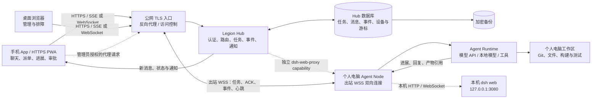

# Legion 个人服务器、个人电脑与手机协同架构设计

日期：2026-10-02。修订：2026-10-04。状态：设计提案，尚未实施。

本文为 Legion 设计一套由个人服务器、个人电脑执行节点和手机控制端组成的远程 Agent 工作架构。用户希望通过手机查看和指挥 Agent、直接与每个 Agent 聊天、查看任务进展，同时让代码和开发工具继续运行在个人电脑。文中将 Agent Network 和 `dsh-remote` 作为不同层面的参考实现：前者参考协作 Hub/Node，后者参考电脑主动建立反向隧道和 DSH Web 透明代理。除明确标为“现状”的部分外，本文描述的是 Legion 的建议设计，不代表 Legion 已经具备这些能力。

### 代码基线与现有能力

本方案的代码核对基线为 `a8ff20debabfe5625eaedc96e4abdb66ffce9332`（2026-10-04）；`deaf3b5e` 已包含在该提交历史中。以下能力已经在 Legion 代码中存在，应作为本方案的复用基础，而不是重新建模：

- `team-hub/agent-conversations.mjs` 持久化 Agent 会话绑定、用户请求幂等回执、消息、问题、命令、进展汇报、读取游标和 Agent/运行关联；消息写入会做现有脱敏及长度校验。
- `team-hub/routes/agents.mjs` 已提供 Agent 列表/详情、会话消息、命令、运行时上报和问题等 API。当前实际路由包括 `/api/agent-conversations`、`/api/agent-messages`、`/api/agent-commands` 和 `/api/agent-runtime`；本方案后文示例 API 仅在明确标为“新增”时才表示需要新增接口。
- `team-hub/run-store.mjs` 是任务 Attempt、租约、`leaseEpoch`、运行事件及状态转换的持久化所有者；领取、续租和状态迁移在 Hub 数据库事务内执行。
- `orchestrator/state-machine/states.mjs` 定义现有 13 种 Attempt 状态和 6 种任务状态及其投影约束。远程层不得再建立一套与其竞争的任务权威状态机。
- `team-hub/permission-engine.mjs` 与 `team-hub/approval-binding.mjs` 已提供权限评估和审批动作绑定能力；远程请求应接入它们，而非另造一套仅在手机端或 PC 端生效的审批判断。
- `runtime/adapters/dsh/` 已有 DSH 运行时适配和事件处理。当前 Agent 会话/进展层支持持久化与查询，但详情能力中 `liveSteer`、`nativePause` 尚未实现；持久聊天不等于任意时刻可实时改写正在运行的模型上下文。

以上是代码事实，不等于这些接口已支持公网部署、设备级身份或跨网络运行。`product/local-auth.mjs` 的桌面认证约束 loopback；Team Hub 对非 loopback 访问另有 Token 检查，但尚不能替代本方案所需的用户/设备身份、细粒度授权、密钥轮换撤销和协议防重放。当前工作区的 `docs/SINGLE-ENTRY-BOOT.md` 与 `scripts/legion-start.mjs` 还包含未提交的 DSH Host 启动设计；涉及该启动耦合的内容在实现前应以合并后的代码重新核对。

本次修订明确区分**协作控制面**和**远程访问通道**：Legion Hub 是任务、对话、进展、授权的持久化真相源；电脑 Agent Node 负责本地执行；远程代理只负责安全地把请求送到对应运行时。完整 DSH Web 镜像属于可选管理能力，不能代替 Hub 的结构化任务协议、审计和上下文管理。

## 1. 目标与设计结论

建议采用**服务器负责随时在线的协作中枢，个人电脑负责需要本地工作区的实际执行，手机负责远程控制与查看**的拓扑。手机和电脑连接同一个 Hub；手机不直接连接家中电脑，也不承载任务状态或模型运行。电脑到 Hub 的首选连接为持续出站的 WSS 双向通道，承载任务领取、确认、进展和心跳；HTTP API 用于管理和恢复查询。手机通过 HTTPS 和 SSE/WebSocket 访问 Hub。

这使服务器不必承担代码执行或 GPU 推理。Hub 的工作主要是身份认证、任务路由、聊天与进展事件持久化、在线状态和通知。具体 Agent runtime、仓库、构建工具及本地模型（若使用）继续留在电脑。需要电脑本地文件的任务，只能在电脑在线且执行节点可用时运行；服务器可以接收任务并保留排队状态，但不能替离线电脑读取其工作区。

核心体验不是单独增加一个“远程终端”，而是在同一 Agent 详情中汇合三类信息：用户与 Agent 的对话、Agent 正在做的任务、可追溯的进展和结果。每条进展都关联任务及来源；用户对 Agent 的聊天和任务状态不能互相冒充。

### 1.1 与现有 Legion 的关系

本文中的“Legion Hub”是现有 `team-hub` 控制面在服务器上的目标部署形态，不是新建一套平行的聊天/任务服务。已有对话、Agent 命令、Attempt/租约、运行事件、审批和状态投影应继续由现有模块负责；需要新增的是远程设备注册与身份、Node 出站连接、网络协议适配、服务器部署配置、跨网络恢复与数据保护。Hub 仍是任务及协作记录的权威来源，PC Node 只执行已授权工作并报告事实。

迁移分两步，避免把本地进程直接假定为可无改动搬到 VPS：

1. **过渡/远程访问模式**：现有 Team Hub、SQLite、DSH Host 和工作区仍在个人电脑；个人服务器只提供 TLS 入口/反向隧道或中继。它复用最多、网络故障面较小，但 PC 关机时 Hub 和任务 API 也不可用，手机不能向服务器持久排入离线任务。
2. **目标/服务器权威模式**：把现有 Team Hub 与数据库作为同一个逻辑 Hub 部署到个人服务器；PC 上保留 DSH Host、Agent runtime 和项目工作区，由 Node 通过认证的出站 WSS/HTTPS 执行远程派发。此模式支持 Hub 在 PC 离线时保留任务，但需要新增设备协议、服务端部署适配和网络故障恢复。首版仍由单个 Hub 实例拥有 SQLite 写入权，不允许手机、PC Node 各自直接写 Hub 数据库。

本设计的目标架构是第二种模式；第一种是可选的先行部署，不应被描述成已具备服务器排队能力。迁移到目标模式前，必须验证 Hub 进程能否在没有本机 DSH Host 的服务器环境独立运行；若当前启动入口仍把二者绑定，需先把启动职责拆开或提供独立 Hub 服务入口。

### 1.2 架构收敛与方案选择

`dsh-remote` 展示了一条成熟的远程访问链路：电脑 Bridge 主动连 Relay，手机请求经 Relay 和 WebSocket 帧协议回到电脑上的 `127.0.0.1:3080`。这种模式解决 NAT 穿透和“手机看到 DSH Web”的问题，但其自建 Relay 的在线设备注册表在进程内；它转发 HTTP/WebSocket，不是跨 Agent 任务队列或上下文数据库。Legion 应借鉴它的出站隧道、心跳、帧关联、流式转发和重连方式，而不把 Relay 当作任务真相源。

| 方案 | 适用范围 | 主要代价 | 建议 |
| --- | --- | --- | --- |
| Legion 原生执行通道：Node 通过 WSS 收取结构化任务并回报事件 | 手机聊天、派单、Agent 进展、多 runtime 编排 | 需要维护 Node 协议和 runtime 适配器 | **首选主路径**，是 Legion 产品能力的基础 |
| 透明代理完整 DSH Web：转发本地 DSH HTTP/WebSocket | 从手机临时接管现有 DSH Web，使用其原生界面和高级设置 | 暴露面大、依赖 DSH Web 接口兼容，不提供 Legion 级任务语义 | 作为显式启用的运维/兼容入口，不作为首版任务 API |
| 混合方案：共享出站连接底座，按 capability 暴露任务协议或 DSH Web 隧道 | 需要远程协作和偶尔完整管理 DSH 的个人部署 | 通道权限必须隔离；不可把完整 UI 代理默认授予普通 Agent 操作 | 可作为后续演进目标；首版只实现原生任务通道 |

不建议首版部署两套互不关联的隧道和设备目录。若以后提供 DSH Web 镜像，应复用受认证的连接基础设施，但为 `task.*` 与 `dsh-web-proxy` 定义不同 capability、令牌和审计策略；关闭 Web 镜像时，Agent 任务和消息通道仍应正常运行。

## 2. 目标与非目标

### 2.1 目标

- 手机上查看 Agent 在线状态、当前任务、最近进展和任务结果。
- 用户可以从手机向指定 Agent 发起对话或任务；Agent 的回复和状态变化能实时或近实时返回。
- 在 Hub 保存可恢复的任务、消息、事件和路由状态，Hub 或客户端短暂重启后仍可查看历史。
- 电脑从内网主动建立到 Hub 的连接，不要求在家庭路由器或电脑上开放入站端口。
- 保留本地执行边界：仓库、终端、运行时和开发凭证仍由个人电脑管理。
- 对离线、重连、重试、取消、审批、并发和结果归属定义清晰行为。

### 2.2 非目标

- 首版不把个人电脑上的桌面画面或鼠标键盘完整流式转发到手机。
- 首版不承诺多个 Agent 自动共享各自全部隐藏推理或完整模型上下文。
- 首版不把 Hub 当作代码执行沙箱，也不将任意 shell 命令开放给公网调用者。
- 首版不要求个人服务器运行大模型或配置 GPU。
- 不把聊天记录等同于模型上下文；Agent 每次实际获得的上下文由会话策略、任务摘要、权限和模型上下文窗口共同决定。

## 3. 系统拓扑



服务器与电脑之间应由电脑发起出站连接。Hub 不需要主动进入用户家庭网络，也不必访问电脑的 RDP、SSH 或开发端口。公网入口只暴露 HTTPS/WSS；管理 SSH 应限来源地址或使用 VPN / 堡垒机。任务控制通道是结构化协议；可选 DSH Web 管理通道才是受限范围内的 HTTP/WebSocket 代理。

## 4. 组件职责

| 组件 | 职责 | 不负责 |
| --- | --- | --- |
| 手机控制端 | 登录、选择空间和 Agent、发送消息/任务、接收流式进展、查看产物、审批高风险动作 | 保存唯一任务状态；直接持有电脑文件系统凭证 |
| 桌面管理界面 | Agent 与设备管理、配置、日志、执行节点健康检查、恢复操作 | 绕过 Hub 直接执行远程 shell |
| Hub API | 用户与设备认证、授权、消息/任务写入、任务分配、事件订阅、幂等和审计 | 调用个人电脑上的项目工具；执行模型推理 |
| Hub 数据库 | 持久化对话、任务、任务事件、Agent/设备登记、授权和消费游标 | 保存完整工作区文件或任意模型隐藏状态 |
| 个人电脑 Node | 建立出站会话、接收分配给它的工作、启动本机 Agent runtime、回报阶段与结果、维护本地工作目录 | 在 Hub 无授权时接受任意远程命令 |
| Agent Runtime | 结合获准的项目上下文调用模型和本地工具，产生回答、进展和产物 | 保证长时间任务永不失败；自动获得其它 Agent 的完整上下文 |
| 执行通道 / Relay | 认证在线 Node、传送任务帧和回执、心跳、断线检测、限流与流恢复 | 保存任务最终状态；替 Hub 决定授权；把任意代理流量视为安全 |
| TLS 反向代理 | HTTPS、证书续期、请求大小与速率限制、必要的 WebSocket/SSE 转发 | 代替应用层权限判断 |

建议把“Agent”逻辑身份与“执行设备”区分开：一个 Agent 可以配置在某个个人电脑节点上运行；同一 Agent 以后也可以迁移到另一台节点。任务分配应指向 Agent 身份，再由 Hub 根据能力、项目授权和在线状态选定节点。在线设备列表是 presence 投影，不是任务持久化表；Node 离线后任务状态必须仍可从数据库读取。

## 5. 对话、任务与共享上下文

### 5.1 三种数据分别管理

1. **对话记录**：用户和某 Agent 的消息及 Agent 的答复，按 `space_id + agent_id + conversation_id` 归档。
2. **任务记录**：目标、负责人 Agent、执行设备、状态、截止时间、取消请求、结果摘要和产物引用。
3. **任务事件**：排队、已接收、步骤进展、等待用户、失败、重试、完成等追加式事件，保留时间、来源和关联 ID。

聊天消息可以创建任务或关联既有任务，但不能把一条普通消息误显示为执行进度。Agent 回报“正在运行”也不能单独证明工具正在成功执行；工作状态必须由 runtime 心跳、任务事件和超时规则共同计算。

在现有实现中，这三类数据已有部分映射：会话、消息、Agent 命令和汇报由 `team-hub/agent-conversations.mjs` 管理；Attempt、租约与运行事件由 `team-hub/run-store.mjs` 管理；任务本身使用现有 task store 和六态任务状态。实施远程能力时应扩展这些现有记录及其关联键。新增设备连接/presence 表只表示节点连接和能力，不得复制一份任务状态或对话历史作为另一权威副本。

### 5.2 上下文共享的边界

Hub 统一保存可共享的显式状态：会话消息、任务说明、用户补充、批准结果、Agent 的结构化进展、完成摘要和产物链接。开始或恢复任务时，Hub 将有权限的相关状态打包成明确的上下文输入，交给目标 Agent。

Hub 不应假设模型服务保存了可跨设备恢复的“脑内状态”。运行时崩溃后，恢复依靠持久化消息、任务检查点、文件状态和摘要重建。各 Agent 仍有各自的系统指令、工具权限、项目文件和上下文窗口；仅将聊天记录放进同一数据库，并不会自动让 Agent 理解其他 Agent 做过的所有工作。

多 Agent 协作通过显式交接共享必要上下文：发送方提交目标、已完成事项、关键决定、文件/提交引用、待解决问题和安全限制。Hub 记录交接事件，接收方只取得当前用户和空间授权允许的内容。大文件放项目存储或工作区，不复制进每次消息；聊天消息保存引用和校验信息。

### 5.3 推荐上下文包

```json
{
  "task_id": "task_...",
  "conversation_id": "conv_...",
  "goal": "用户明确要求完成的目标",
  "constraints": ["仅操作已授权项目", "危险操作前等待审批"],
  "accepted_decisions": [],
  "recent_messages": [],
  "handoff_summary": "上一个 Agent 或先前运行交接的摘要",
  "workspace": {"project_id": "...", "repo_ref": "...", "working_tree": "..."},
  "artifacts": [],
  "resume_checkpoint": null
}
```

这是建议的契约示意，不是现有 Legion API。具体字段要结合 Legion 当前数据库和 runtime 接口定稿。上下文应可追踪来源和版本；若摘要压缩了历史，仍需保留原消息供回看。

### 5.4 DSH 会话与 Legion 会话的映射

`dsh-remote` 中手机和桌面端之所以能看到同一份对话，是因为二者最终访问同一台电脑上的同一个 `dsh web` 实例；Relay 负责路由，并不复制或合并模型上下文。Legion 接入 DSH 时应明确保存 `legion_agent_id → runtime_instance_id → dsh_session_id` 映射，并按 DSH 持久会话 ID 恢复；不能仅凭一个短期 WebSocket 或 browser session cookie 推断对话连续性。

一个 Legion 对话默认绑定一个 runtime 会话。若新任务复用旧 DSH 会话，必须记录复用依据、上下文边界和用户可见的会话链接；若使用新会话，则由 Hub 传入经授权的任务摘要和资料引用。运行时无法提供稳定会话 ID 或事件游标时，将适配器标为“有限恢复”：保留 Hub 记录，但不宣称能恢复 DSH 内部隐藏状态。

完整 DSH Web 代理会触达 DSH 的设置、凭据和特权操作面，权限明显高于结构化任务通道。首版任务客户端不得通过透明代理执行 Agent 操作；管理员若启用该入口，须单独配对、单独授权、记录审计，并默认仅管理员可见。

这部分是现有 DSH adapter 的远程化约束，不表示 DSH session 与 Legion conversation 目前已经具备完整的一对一持久映射。实施前应从 `runtime/adapters/dsh/` 核实可用的 session ID、事件游标和恢复接口；缺少稳定标识时，Legion 以自身消息和运行事件为可恢复依据，并将 DSH 内部会话恢复标为有限能力。

## 6. 核心交互流程

### 6.1 手机向某 Agent 发起工作

1. 用户在手机选择空间和具体 Agent，输入消息或选择“创建任务”。
2. Hub 校验用户对空间、Agent、项目和操作的权限；为提交分配客户端幂等键，避免网络重试重复创建。
3. Hub 持久化 Agent 会话消息；若该消息要求执行，则在同一事务中建立任务并写入 `queued` 事件，然后尝试发送。
4. Hub 检查目标 Agent 所绑定节点的心跳、runtime 能力和项目授权。在线则下发；离线则进入队列并明确显示“等待电脑上线”，不能显示成“执行中”。
5. 电脑 Node 以任务 ID 和租约版本接收工作、回 ACK、准备本地工作目录，并报告 `accepted` / `running`。Bridge/Relay 在线只说明传输通道可达，不等于 Agent runtime 已接收或运行。
6. Agent 通过 runtime 事件/工具回调发出结构化阶段进展；Hub 持久化后经 SSE/WebSocket 推给手机。透明转发到 DSH Web 的字节流不能自动视为可审计的任务进展。断线的手机可用事件游标补读。
7. Agent 将最终答复、结果摘要、分支/提交/文件路径或日志引用回传。Hub 标记终态并通知用户。

### 6.2 用户在执行期间继续聊天

用户可以继续向该 Agent 发送消息。每条消息必须有明确语义：

- **补充指令**：附加到正在运行任务的可变输入队列；runtime 在安全检查点读取，或提示用户它只能用于后续步骤。
- **新任务**：与正在执行的任务分开排队，避免两个任务并发写同一工作目录。
- **询问进度**：作为对话请求，由 Agent 或 Hub 根据当前持久状态回答；不隐式修改任务目标。
- **取消**：创建取消请求并显示“取消中”；Node 确认停止后才标为“已取消”。如果 runtime 不支持安全取消，应解释正在完成当前不可中断步骤。

聊天 UI 应在消息附近展示其影响范围，例如“已加入任务 #123”或“新任务，排在当前任务之后”，让手机用户不必猜测消息是否被 runtime 看见。

### 6.3 断线和恢复

- Node 通过单调事件序号和幂等事件 ID 回报状态；重复事件安全忽略。
- Hub 对未确认任务保留租约和接收者；Node 重连后报告已知任务及最后事件序号。
- 超过心跳阈值，Agent 显示“连接中断”，任务显示“状态待确认”，而非自动判失败或完成。
- 对可安全重试任务使用租约到期后的重新领取；对可能有副作用的工具调用先查任务执行账本或要求用户介入，避免重复提交、付款、删除等操作。
- 手机重连使用最后已读事件游标补齐缺失动态，并从 Hub 读取当前任务投影。
- Hub 重启会丢失活跃 socket 和内存 presence，但不能丢任务/消息/事件；Node 重连后重新注册并对账任务。服务器权威模式下，电脑离线时 Hub 可持久接收任务并标注“等待电脑上线”，不能承诺后台执行或唤醒电脑。
- Relay/Node 断开只证明观察通道失效，不足以断言正在电脑上运行的 DSH turn 已停止。恢复时先查询 DSH/runtime session 状态；缺少可靠状态 API 时呈现“执行状态未知”，不得自动重复派发。
- **PC 到服务器断网**：服务器继续提供历史、接收新任务并将其置为等待状态；PC 上已启动的 runtime 可能继续本地执行，但租约续期和结果回传不可用。Node 必须保留最小运行账本；重连后按 task/attempt/epoch 对账，结果无法验证则进入 `UnknownOutcome`，不得盲目重跑。
- **服务器/Hub 不可用**：手机无法提交或读取权威状态；PC 已在本地启动的步骤可按 runtime 自身行为继续，但不得在本地另建一套可与 Hub 冲突的任务状态。Hub 恢复后通过账本对账。
- **PC 关机/休眠**：Node 不在线，不能收取新任务；服务器保留的任务受有界队列与 TTL 管理。首版不承诺远程唤醒；WoL 是单独的网络/硬件能力。
- **模型服务不可用**：Node 保持任务可观测并按现有 retry/failure policy 处理；不把模型 API 故障误显示为设备离线。
- 过渡/远程访问模式下，Hub 本身仍在 PC；因此 PC 离线不仅不能执行任务，手机也不能访问 Hub 或排队。UI 和部署说明必须与服务器权威模式明确区分。

## 7. 状态、API 与远程协议

### 7.1 任务状态沿用 Legion 现有状态机

Legion 的 Attempt 状态为 `Queued`、`Leased`、`PreparingWorkspace`、`BuildingContext`、`Running`、`AwaitingApproval`、`Validating`、`HandingOff`、`Completed`、`RetryableFailure`、`UnknownOutcome`、`Cancelled`、`DeadLetter`；任务状态为 `todo`、`in_progress`、`in_review`、`done`、`blocked`、`canceled`。这些状态及其投影规则由 `orchestrator/state-machine/states.mjs` 维护。本方案不增加第二套有权威性的 `dispatched/accepted/succeeded/expired` 任务状态机。

远程端可以派生**展示投影**，但必须能回溯到现有事实：在线/离线来自 Node 心跳；排队来自 `Queued`；已领取/准备来自 `Leased`、`PreparingWorkspace` 或 `BuildingContext`；执行来自 `Running` 及其运行事件；等待用户/审批来自 `AwaitingApproval` 和相应问题/审批记录；取消中是未完成的取消命令；完成、失败或结果不确定分别映射到现有终态/失败状态。租约过期后是否重试由现有 Attempt 规则和副作用安全性决定，不新增 `expired` 任务事实。UI 可将运行中连接中断展示为“状态待确认”，底层记录使用 `UnknownOutcome` 或现有失败恢复流程。

实现任何新增投影时，必须更新现有状态映射并覆盖上述状态；若 task/Attempt 的现有映射对某状态不完整，应先修复该映射，不能用远程状态掩盖遗漏。

### 7.2 API 复用与新增边界

优先扩展现有 `/api/agent-*`、`/api/runtime/*` 和事件读取能力，并保留 `agent-conversations.mjs` 与 `run-store.mjs` 的单一写入职责。下表是产品语义，不是要求把已实现接口改名：

| 产品操作 | 现有/目标边界 | 处理要求 |
| --- | --- | --- |
| 按 Agent 聊天、读取历史和发送命令 | 现有 `/api/agent-conversations`、`/api/agent-messages`、`/api/agent-commands` 等路由 | 保持幂等键与现有 conversation/task/attempt 关联；不得再建平行消息 API |
| 运行时领取、续租、提交结果 | 现有 `/api/runtime/*` 路由和 `run-store.mjs` | 通过 Hub 事务修改 Attempt/租约；跨机器部分仅作为 RPC 调用，不让 Node 直接写 SQLite |
| Node 配对、设备身份、能力协商、心跳和撤销 | **新增**设备控制 API/WSS 协议 | 与用户手机会话分开认证，按设备和 capability 授权，支持版本协商、撤销和审计 |
| 手机断线续读进展 | 复用现有运行事件/Agent 读取游标；如现有端点不足再增加查询接口 | 游标单调、事件有稳定 ID、重复消费安全 |
| 取消/停止 | 扩展现有 Agent 命令与 runtime 取消处理 | “取消请求已记录”与“执行已停止”是不同事实 |

Node 协议帧至少携带 `request_id`、`node_id`、协议版本、任务/Attempt ID、`leaseEpoch`、幂等 `event_id` 和确认游标。租约续期与结果提交必须验证当前 Attempt、Node、epoch 和租约；旧 Node 或旧 epoch 的迟到结果不得覆盖新 Attempt。消息体设上限并进行输入校验。协议首版规定 `protocol_version` 精确主版本及 Hub 接受的 `min_version/max_version`；不兼容时拒绝连接并给出可诊断原因，不静默降级。

透明 DSH Web 隧道继续是独立 capability，不复用任务 RPC 的任意路径，也不得借协议升级成为通用 shell。

## 8. 部署方案

### 8.1 个人服务器

- 使用持续维护的 Ubuntu/Debian Linux 主机运行 Hub 和数据库；Hub 不需要 GPU。Legion 的持久任务 API、Node 任务通道和 Relay 最初可同进程部署，但应按模块隔离；规模增长后才拆服务。
- 绑定私有回环地址，由 Caddy、Nginx 或同类反向代理提供 TLS。公网仅开放 `443/TCP`；管理 SSH 仅对可信来源开放。若使用 VPN，也可将 Hub 限定在 VPN 网络内。
- 首版继续复用现有 Team Hub 数据模型，不创建第二个数据库/消息账本。SQLite 可作为单台服务器、单 Hub 写入者的初期权威数据库；Hub 的 `withTx`、租约与状态迁移留在同一服务端事务中，远程 Node 通过 RPC 请求，绝不直接访问数据库文件。PC 成为远程 Worker 本身并不要求迁移 PostgreSQL。
- SQLite 文件、附件/产物元数据和备份分别规划持久化路径；定义 WAL/备份一致性、磁盘空间告警、加密备份与恢复演练。只有多 Hub 写入/高可用、并发写入量或运营要求证明 SQLite 不满足时才评估 PostgreSQL；迁移评估需盘点 `withTx`、`INSERT ... ON CONFLICT`、`rowid`、JSON 文本字段和时间/锁语义，并增加双引擎一致性测试，不能把数据库替换视作配置切换。
- 等待设备的任务队列必须有界。首版建议默认每个空间最多 100 个待派任务、待派任务 7 天过期；产品配置可收紧，扩大上限需要有容量与滥用评估。到期事件映射到现有 dead-letter/blocked 策略并通知用户，不新增权威 `expired` 任务状态；到达上限时拒绝新任务并明确提示，不静默丢弃。
- Hub 由单一服务管理器监督（例如 systemd）；避免 systemd 与 PM2 同时重启同一 Hub。设置 `/health` 检查、磁盘/内存告警、日志轮转、时钟同步和安全更新窗口。
- 初期资源可从 2 vCPU、2 GB RAM、足够容纳数据库与备份的 SSD 起步，再基于实际节点数、历史保留和同时任务数测量扩容。Agent Network 官方部署资料给出的 Hub 本体资源较低；此规格是面向可维护个人部署的建议，不是其官方最低要求或 Legion 基准测试。

### 8.2 个人电脑

- 在电脑安装 Node 及所选 Agent runtime，并登记为 Hub 的执行设备。
- 仅开放电脑的出站 WSS/HTTPS 到 Hub；不在家用路由器做端口映射。电脑睡眠、关机或网络断开时，Node 无法接收新任务或汇报；本机已启动的 runtime 可能继续，也可能因其自身依赖而暂停，必须通过 runtime 状态查询确认。Hub 可排队并报告等待状态，但不能替代 WoL/电源管理。
- runtime 使用独立低权限账户；只挂载允许的项目工作区。提供项目级执行目录或 Git worktree，避免并行任务互相覆盖；工作区清理与回收必须有显式策略。
- 模型可通过云 API 使用，也可使用电脑上的本地模型。无论哪种方式，Hub 都只传递任务和事件，不承担模型推理。
- 若电脑为 Windows，选择与 Agent runtime 兼容的运行模式。Agent Network 文档建议 WSL 作为通用 Linux runtime 环境；其原生 Windows 能力与各 runtime 的支持程度不同。应以实际安装版本和要用的运行时验证后再定稿。
- 目前 DSH runtime 不是可假定独立存在的通用 Linux daemon。若其执行入口依赖正在运行的 DSH Host，PC Node 应先作为 DSH Host 内/旁的窄权限适配器运行；将其抽取为通用 daemon 属于单独的解耦工作，不能在本方案中视为零成本部署配置。
- 仅当需要从 Hub 动态创建/停止/重启电脑上的多个 Agent 时，才考虑安装高权限的主机守护节点。若只运行一个预先配置好的 Agent Node，无须开放此类主机控制面。
- 若首版接入 DSH，先实现窄权限 DSH adapter：创建/恢复会话、发送 prompt、读取受支持的事件和提交审批；完整 `dsh web` 反向代理作为单独的管理员开关。自建 `dsh-remote` 的 relay 模式没有多用户隔离，访问密钥是实例根凭据；其公开文档也说明自建模式不启用 E2EE，因此只能把自有 VPS 当作可信服务端，不要把“WSS 隧道”误称为端到端加密。

### 8.3 手机端

- 使用官方移动端（若所选平台和发行渠道可用）或经 HTTPS 发布的移动适配 PWA。
- 手机以用户身份接入 Hub；消息、任务、进展、待审批动作均来自同一 Hub。
- 移动网络可能休眠或切换，界面不能依赖永久 WebSocket。恢复时以事件游标从 Hub 补齐；推送通知只作提醒，Hub 状态为准。
- 登录采用短期访问令牌和可撤销刷新凭据；支持设备退出、丢失手机撤销会话和二次验证/Passkey 等后续增强。

## 9. Agent Network 对照与 Legion 借鉴

以下是 Agent Network 文档所描述的参考能力；部署前须以当前发布版本复核具体命令和限制：

| 参考实现能力 | 对 Legion 的借鉴 | 边界/注意点 |
| --- | --- | --- |
| Hub 集中提供 API、事件流和 MCP 等接入方式，Agent Node 运行在用户机器 | Hub/Node 分离适合“服务器常在线、电脑本地执行” | Hub 在线不意味着离线电脑能执行本地任务 |
| 桌面和手机客户端可连接同一 Hub | 统一会话、消息、任务动态和设备状态 | 客户端只是同一数据面的不同界面，需服务器权限和持久化支持 |
| Hub 使用本地数据库保存协作数据 | 任务、会话、事件均应由 Hub 持久化 | 持久化记录不等于模型隐藏上下文可恢复 |
| Node 与 Hub 通过事件/流式通信协作 | 采用可续读事件游标和心跳 | 设计好重放、幂等和状态对账，避免“看起来实时但掉事件” |
| DSH 插件可把任务转给 DSH | 可探索 Legion 与 DSH 的执行适配器 | 公开说明将该插件标为预览；任务通常使用新的 DSH 会话，跨任务上下文不共享，且有附件限制，须实测再承诺体验 |
| daemon 可管理主机上的 Agent | 多节点/动态生命周期管理可作为后续运维能力 | daemon 权限高；个人电脑单 Node 场景不必默认安装 |

核心借鉴是**统一控制面与本地执行面分离**，而不是将所有 Agent 的运行都搬到服务器。`dsh-remote` 补足的是网络可达性和既有 DSH Web 的远程镜像；其透明 HTTP/WebSocket 转发本身不提供 Legion 所需的共享任务库、跨 Agent 上下文包、离线任务队列或运行时恢复语义。对 Legion 特别重要的是把“按 Agent 聊天”与“任务进度汇报”纳入同一时间线，同时用明确关联区分消息、任务和机器状态。

## 10. 安全、权限与隐私

- 反向代理 TLS 是必要条件；不要把 Hub 管理端口或 Node 管理端口直接暴露到公网。Team Hub 现有非 loopback Token 检查可作为过渡保护，但不能直接视为最终的多设备身份系统。Node 到 Hub 的 WSS 使用专属设备凭据；单次配对码应短时、一次性、限速，设备令牌可单独撤销和轮换，并绑定节点 ID 与能力范围。
- 区分用户会话、桌面会话、Node 设备令牌和服务间密钥。凭据可单独撤销、轮换；日志不记录令牌和模型密钥。
- 授权至少按用户、空间、Agent、项目和动作检查。Agent 只能访问其被分配的项目；将“能聊天”与“能执行危险工具”拆成不同权限。服务端复用现有 `permission-engine.mjs` 与 `approval-binding.mjs` 对请求及动作参数进行权限评估和审批绑定；PC 执行前还要验证服务端签发/持久化的授权仍匹配当前任务、Attempt、`leaseEpoch`、动作参数和有效期，不能让客户端自行宣称已获批。
- 默认对删除文件、推送远程仓库、部署、访问新凭据、外部消息发送等副作用操作实施确认或策略门控。确认需绑定任务、动作参数、权限版本和过期时间，避免批准后参数被替换；审批回执经 Hub 验证并原子消费，PC 只执行匹配的授权结果。
- 对审批回执设置明确过期时间且 fail-closed；通知通道掉线、事件未重放或用户回复过期时不得默认为批准。若添加微信等通知面，通知只是提醒与受限回执入口，Hub 任务事件仍是审计真相源。
- 可选 DSH Web 代理拥有比任务 API 更宽的权限。它必须与普通任务访问分离，管理员显式开启并单独撤销；不能因用户可以给 Agent 发消息就默认允许 Agent 调用该代理访问 DSH 设置、凭据或任意管理接口。
- 每个任务记录发起者、执行 Agent/设备、所用项目引用、权限版本、开始/结束、重试、审批和产物。审计日志采用追加写入并设置保留周期。
- 工作区隔离优先采用独立 Git worktree 或任务目录；对私有仓库、生产凭据和个人目录实行最小访问。Agent 输出作为不可信数据处理，不允许其通过输出文本覆盖 Hub 系统策略。
- **数据出境与保留**：服务器权威模式会把用户提示词、Agent 回复、任务摘要、进展/错误、审批元数据和产物引用写入服务器数据库；如果上下文包包含代码片段或日志，它们也会离开 PC。现有消息脱敏（`runtime/adapters/dsh/redact.mjs`）和长度限制只是输入保护的一部分，不是完整隐私策略，且服务端收到后脱敏无法保护传输前内容。Node 应在发送前按数据类型脱敏；默认上传结构化进展和必要摘要，不上传完整源码、环境变量、凭据或整份终端日志。产物默认保存于 PC 工作区并仅上传引用/哈希；若用户显式启用服务器附件存储，需另设加密、访问控制、大小限制和保留期。定义消息/事件保留期、删除传播、备份到期清除和审计保留；密钥不得进入上下文、日志或事件载荷。
- **数据权威与离线策略**：首版服务器权威模式采用单一服务端写入源；PC 仅缓存恢复所需的最小本地运行账本。首版不支持 Hub 与 PC 双向离线编辑/冲突合并。若用户选择过渡模式，则历史及队列仍在 PC，服务器不持久化任务；必须在产品说明中呈现该取舍。
- 备份应加密、异地保存，并定期验证能否恢复；服务器磁盘加密和宿主机补丁由运营者负责。

## 11. 可用性、监控和故障行为

首版应监控 Hub 健康状态、Node 最近心跳、待派任务年龄、任务超时数、事件写入错误、数据库容量、备份结果和通知失败。用户界面至少区分：Hub 不可达、Hub 可达但电脑离线、Agent 在线但运行时不可用、任务运行中、任务等待用户、任务结果待确认。

Hub 或网络恢复后，先对账持久任务与 Node 正在运行的任务，再恢复分发；不可仅凭重连后的一个“在线”信号就重新执行所有未完成任务。Node 端保存最小必要的本地运行账本，Hub 是任务和协作事件的权威来源；正在执行的进程状态则需 Node 重连后确认。

对照 `dsh-remote` 的实现，还需区分“路由器已连上电脑”与“Agent 可用”：其 `/_devices` 设备列表按活跃 WebSocket 注册表构造，表示在线连接，不表示某个任务已接收。Legion 应分别显示 Node transport、runtime health、Agent busy/idle 和 task state；Hub 重启的恢复测试要覆盖任务账本、设备重新注册和活跃任务对账。

## 12. 分阶段落地

### 阶段零：验证 DSH 适配边界

- 在隔离测试环境验证 DSH session ID 的创建/恢复、prompt 写入、审批回执、事件订阅/游标及断线重连语义。
- 确认 DSH Agent/子代理如何映射到 Legion Agent 身份，以及哪些执行状态是权威事件、哪些只是 UI 展示。
- 验证必须共享单一 DSH 实例时的并发约束、runtime 重启后的恢复能力和凭据持有边界；若接口不足，标注为有限恢复，不用 UI 代理伪造可靠任务状态。
- 盘点现有 Team Hub 会话/消息/命令 API、Attempt/任务状态映射、租约、事件游标、审批绑定与非 loopback Token 行为；输出“复用/扩展/新增”接口清单，不再设计第二套任务或对话存储。
- 验证 Hub 能否在无 DSH Host 的服务器环境独立启动；若不能，先把 Hub 服务生命周期与 PC DSH Host 生命周期拆分，并证明现有本地运行不回归。
- 验证目标架构中单 Hub + SQLite 的事务边界、WSS 断开后的租约续期/过期行为、Node 本地运行账本及 `UnknownOutcome` 对账；不以多节点 Hub 或 PostgreSQL 作为首版前提。

### 阶段一：可远程观察与单 Agent 聊天

- 复用 Team Hub 现有会话、消息、Agent 命令、任务/Attempt 和运行事件模型；仅增加设备身份/presence/协议所需记录，不复制第二套任务状态。
- 手机/桌面客户端能登录同一 Hub，按 Agent 查看聊天与任务时间线。
- 一台个人电脑 Node 通过出站 WSS 主动连接 Hub，可接收一个预配置 Agent 的任务并回报状态；同一任务不能因 Node/Hub 重连被重复执行。
- 支持心跳、离线提示、重连补事件、完成结果和简单通知。

### 阶段二：可靠执行与上下文恢复

- 加入幂等键、租约、事件游标、取消/超时处理和 Node 状态对账。
- 远程领取/续租/完成必须落到现有 `run-store.mjs` 事务和 `leaseEpoch` 栅栏；为 Node 协议建立最小/最大版本协商、请求幂等和受限消息大小。
- 通过检查点与结构化摘要恢复中断任务；明示重试是否可能重复产生副作用。
- 工作区隔离、产物引用和用户审批落地；运行日志可以按权限回看。
- 如确有管理员需求，增加独立的 DSH Web 管理代理，并使用比任务通道更严格的角色、审计和启用开关。

### 阶段三：多 Agent 与运维增强

- 支持显式 Agent 交接、任务依赖、项目级共享摘要与并行工作区。
- 加入多 Node 路由、能力匹配、设备撤销和动态 Agent 生命周期管理。
- 按真实使用量评估 PostgreSQL、对象存储、队列、推送服务和高可用部署；在此之前维持单 Hub 写入者、SQLite 与有界持久队列，避免引入不必要的分布式基础设施。

## 13. 验收标准

- 电脑在线时，手机能向指定 Agent 发任务，看到接收、开始、进展和完成，并能打开结果引用。
- 电脑离线时，任务明确保持排队/等待状态；电脑重连后按策略领取，不重复创建任务。
- 电脑离线、Relay 重启或手机 SSE/WebSocket 断开时，界面不混淆“连接在线”“runtime 在线”“任务执行中”；恢复后任务与事件可对账，无法确认的执行状态明确显示未知。
- 手机断网重连后可补齐期间进展；重复上报同一事件不会重复显示或重复执行任务。
- 普通聊天、任务补充、创建新任务和取消操作在 UI 和 API 中语义明确。
- 用户可以在对话中查看过去的任务结果；新任务获得的是有来源的会话/任务摘要，不依赖不可见的模型记忆。
- 撤销手机或电脑凭据后，该设备不能继续调用 Hub；一个项目的 Agent 无权读取未授权项目。
- 服务器没有 GPU 时仍可处理控制面操作；模型调用由电脑 runtime 或其配置的模型服务完成。
- 远程展示状态始终来自现有 Task/Attempt 状态机和事件；断线、过期、取消请求不会创造与现有模型冲突的权威状态。
- 使用相同幂等键重复提交不会创建重复消息/任务；旧 Node、旧 `leaseEpoch` 或已撤销设备的迟到回报不能覆盖当前状态。
- 协议版本不兼容、待派队列达到上限或任务超过 TTL 时有明确拒绝/过期事件和用户提示，不静默丢弃或无限堆积。
- PC 到服务器断网、Hub 重启、PC 休眠、模型 API 故障分别有可区分状态；PC 本地可能继续的任务在对账前显示未知，不被自动重复派发。
- 数据发送前按策略脱敏；服务器数据库、备份、附件和保留期有明确配置；默认不上传完整源码、凭据或完整终端日志。
- DSH adapter 的会话映射和恢复在真实 DSH runtime 上验证；透明 Web 代理即使开启，也不会绕过 Legion 的任务权限与审计边界。
- 数据库和备份可以在干净主机上恢复，并恢复任务、会话和进展的关联关系。

## 14. 需要在实施前确定的项目参数

1. 服务器操作系统、域名、是否已有反向代理/VPN，以及可接受的公网暴露范围。
2. Legion 首版所接入的 Agent runtime（例如 Codex CLI/SDK、DSH 或其他）及各自的任务取消和事件能力。
3. 电脑上采用原生 Windows 还是 WSL2，以及任务工作区隔离方式。
4. 手机上先提供 PWA 还是使用已有原生客户端；通知采用 Web Push 还是移动推送服务。
5. 单用户使用还是需要多用户/邀请；对应的空间权限、数据保留和备份周期。
6. 首发部署选过渡/远程访问模式还是服务器权威模式；若分阶段迁移，约定切换时数据库导入、停机窗口和回滚策略。
7. 提示词、错误、源代码片段、产物和日志哪些允许离开 PC；消息、事件、附件、审计及备份的保留与删除期限。
8. 待派队列上限和 TTL（建议初值：每空间 100 个、7 天），以及到期任务的用户提示和重试策略。

这些参数会影响部署配置和适配器实现，不改变 Hub、手机控制端和本地执行节点分离的总体架构。

## 15. 参考资料

以下链接用于核对 Agent Network 与 `dsh-remote` 的公开设计和部署约束。链接内容可能随版本更新；实施前应使用所部署版本的文档及源码复核。

- [Agent Network 架构](https://www.anet.sh/guide/architecture)：Hub、Node、API、事件流和 MCP 的职责划分。
- [Agent Network 桌面与移动端](https://www.anet.sh/guide/desktop-app)：桌面和手机客户端连接同一 Hub 的产品形态。
- [Agent Network 安装说明](https://www.anet.sh/guide/install)：运行时、平台和资源要求；Windows/WSL 运行差异。
- [Agent Network 保持 Hub 运行](https://www.anet.sh/deploy/keep-alive)：进程监督、健康检查和单一监督器建议。
- [Agent Network 生产部署](https://www.anet.sh/deploy/production)：TLS、暴露端口与生产安全建议。
- [Agent Network DSH 集成](https://www.anet.sh/en/guide/dsh)：DSH 插件状态与任务会话限制。
- [Agent Network daemon](https://www.anet.sh/deploy/daemon)：主机 Agent 生命周期管理和运行环境限制。
- [dsh-remote 架构与组件](https://github.com/mrRisega/dsh-remote/blob/main/CONTRIBUTING.md)：Relay、Bridge、PWA 和 DSH 插件的边界，以及开源版与云服务版的区别。
- [dsh-remote README](https://github.com/mrRisega/dsh-remote/blob/main/README.md)：PWA、HTTP/WebSocket 透传、自建部署和许可说明。
- [dsh-remote 自建指南](https://github.com/mrRisega/dsh-remote/blob/main/docs/self-hosting.md)：访问密钥换短期 JWT、服务器 TLS 入口、电脑主动连接和自建安全边界。
- [dsh-remote Relay 协议](https://github.com/mrRisega/dsh-remote/blob/main/packages/relay-router/README.md)：HTTP/WS 帧协议及多实例需要共享注册表的限制。
- [dsh-remote E2EE 协议说明](https://github.com/mrRisega/dsh-remote/blob/main/docs/e2ee-protocol.md)：内容加密的信任边界及自建模式限制；需与 README 当前的分阶段开放说明一并核对。
- [dsh-remote 微信通道说明](https://github.com/mrRisega/dsh-remote/blob/main/docs/wechat-bot-channel.md)：事件通知、审批回执、事件不重放和过期处理的参考。

Legion 仓库内需作为实施基线复核的文件：

- [`team-hub/agent-conversations.mjs`](../../../team-hub/agent-conversations.mjs)：Agent 会话、消息、命令、问题、汇报、游标与运行绑定。
- [`team-hub/routes/agents.mjs`](../../../team-hub/routes/agents.mjs)：当前 Agent API 路由。
- [`team-hub/run-store.mjs`](../../../team-hub/run-store.mjs)：Attempt、租约、事件和状态持久化。
- [`orchestrator/state-machine/states.mjs`](../../../orchestrator/state-machine/states.mjs)：Attempt 与任务状态及其投影规则。
- [`team-hub/permission-engine.mjs`](../../../team-hub/permission-engine.mjs) 与 [`team-hub/approval-binding.mjs`](../../../team-hub/approval-binding.mjs)：权限评估和审批绑定。
- [`product/local-auth.mjs`](../../../product/local-auth.mjs) 与 `team-hub/server.mjs`：桌面 loopback 认证和 Team Hub 非 loopback Token 行为。
- [`runtime/adapters/dsh/`](../../../runtime/adapters/dsh/)：DSH runtime 适配、事件与脱敏。
- [`2026-10-01-agent-conversations-progress-design.md`](2026-10-01-agent-conversations-progress-design.md)：既有 Agent 会话/进展设计基线。

复用范围：可以借鉴公开架构和协议思想；若考虑直接复制、链接或分发 `dsh-remote` 代码，应先核对其 PolyForm Noncommercial 许可与 Legion 的使用/分发场景。
